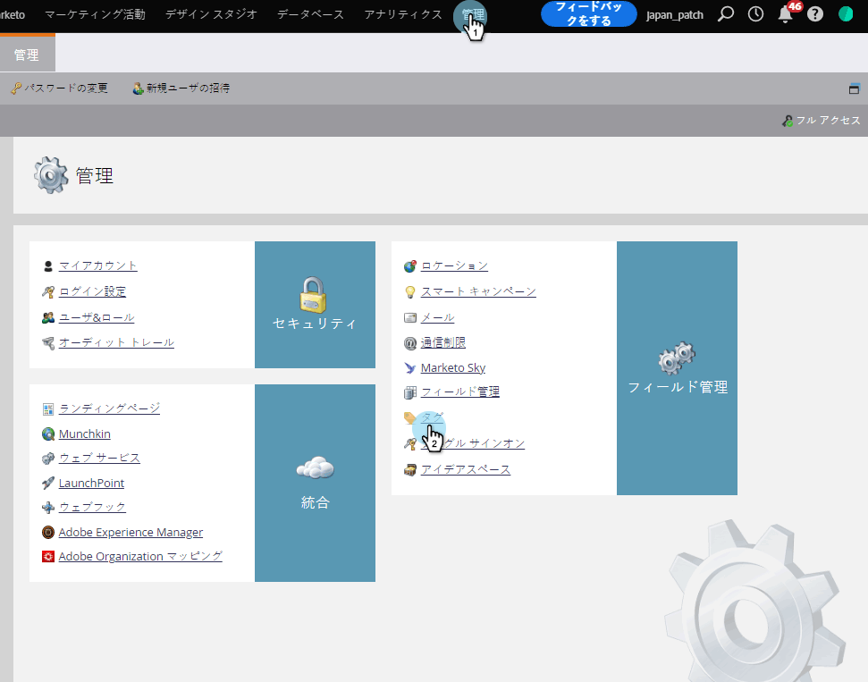
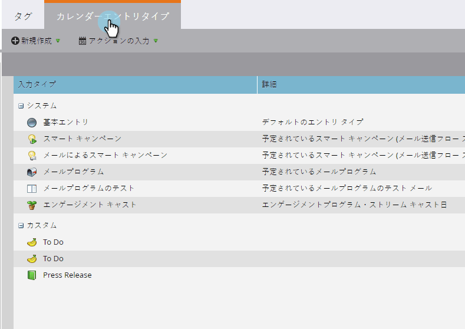
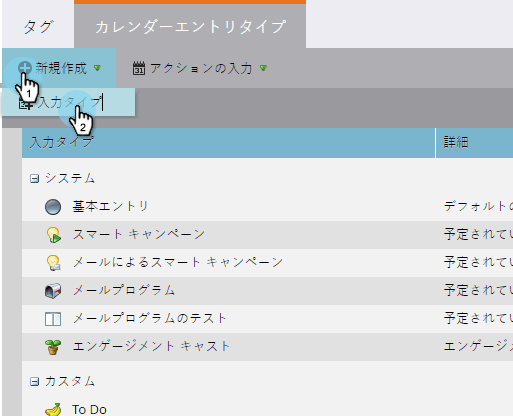
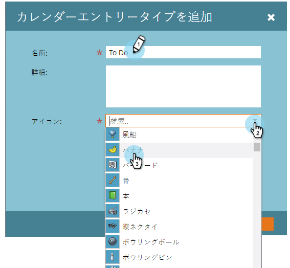
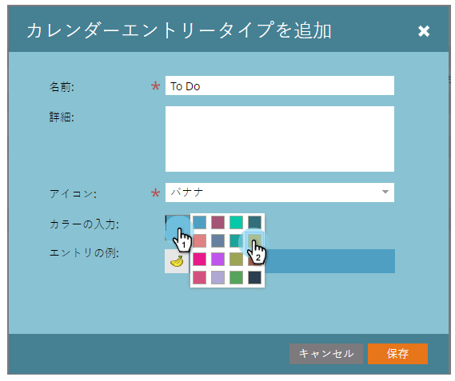
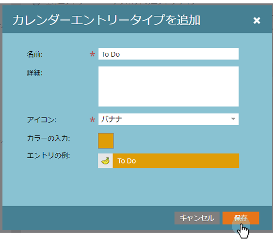

# カスタムエントリタイプの作成{#create-custom-entry-types}

プログラムスケジュール表示で使用するカスタムエントリタイプを作成できます。 これにより、プログラムに影響を与える、マーケティング担当者以外の議題をすべて追跡できます。

1. 「**管理者**」セクションに移動し、「**タグ**」をクリックします。

   

1. [**カレンダーエントリタイプ**]をクリックします。

   

1. 「**新規**」ドロップダウンをクリックし、「**エントリの種類**」を選択します。

   

1. エントリに名前を付け、アイコンを選択します。

   

1. **エントリの色**&#x200B;を選択します。

   

1. 「**保存**」をクリックします。

   

素晴らしい！ これで、スケジュール表示に新しいエントリを作成する場合、このタイプはオプションになります。

>[!NOTE]
>
>最大100個のカスタムエントリタイプを作成できます。
