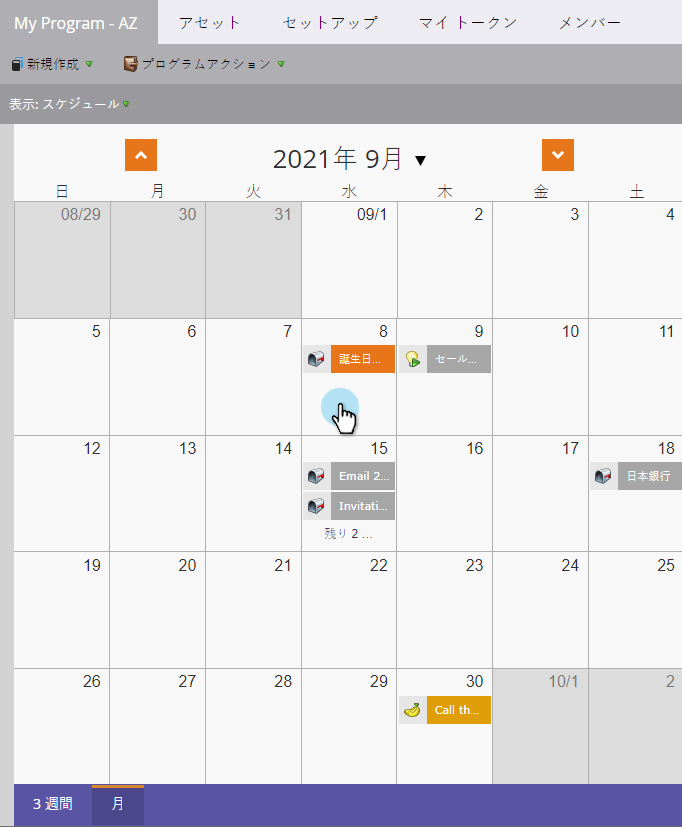
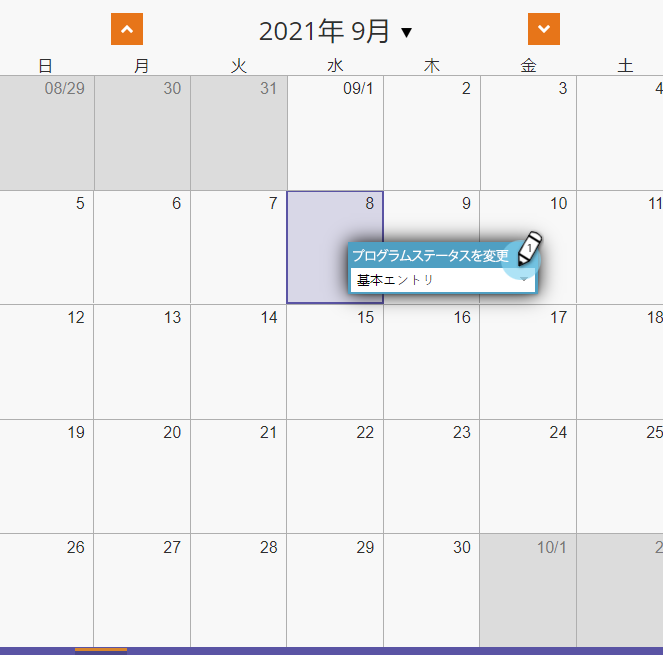
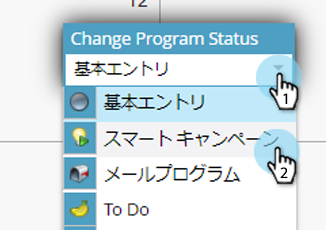
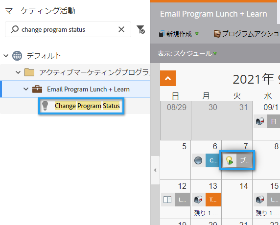
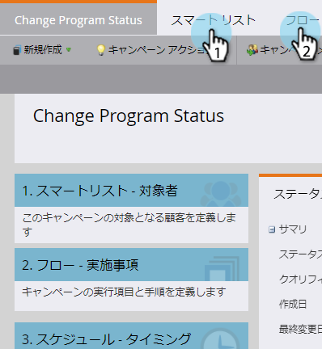
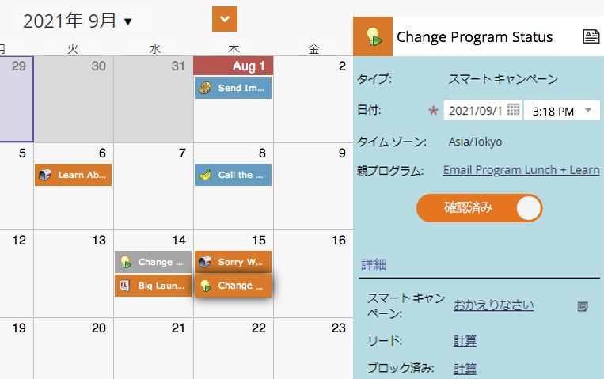

# プログラムスケジュール表示でのバッチスマートキャンペーンの作成{#creating-a-batch-smart-campaign-in-the-program-schedule-view}

新しいスマートキャンペーンを作成し、プログラムスケジュール表示からプログラム内の既存のスマート[を再実行できます。](rerun-a-smart-campaign-in-the-program-schedule-view.md)

>[!NOTE]
>
>この表示で作成できるのはバッチスマートキャンペーンのみです。 トリガーキャンペーンはサポートされていません。

1. 新しいスマートキャンペーンを実行する日付を選択します。

   

1. 参加者の名前を選択します。新しいスマートキャンペーンになります。 **Enter/Return**&#x200B;キーを押して名前を確認します。

   

1. 「**種類**」ドロップダウンをクリックし、「**スマート** **キャンペーン**」を選択します。

   

   >[!NOTE]
   >
   >ドロップダウンから既存のスマートキャンペーンを選択して、実行することもできます。

   

1. [スマートキャンペーン](../../../../product-docs/core-marketo-concepts/smart-campaigns/creating-a-smart-campaign/create-a-new-smart-campaign.md)ルールを選択します。

   

1. このスマートキャンペーンは、スケジュール表示と入口の詳細で確認されたとおりに表示されます。

   

これにより、プログラムーで新しいスマートキャンペーンが実行されます。