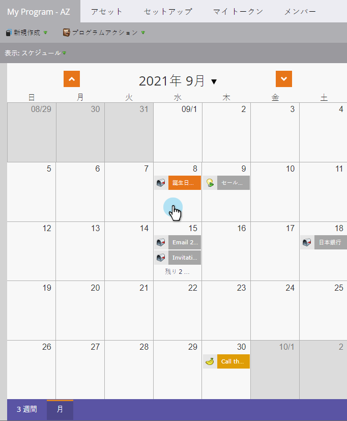
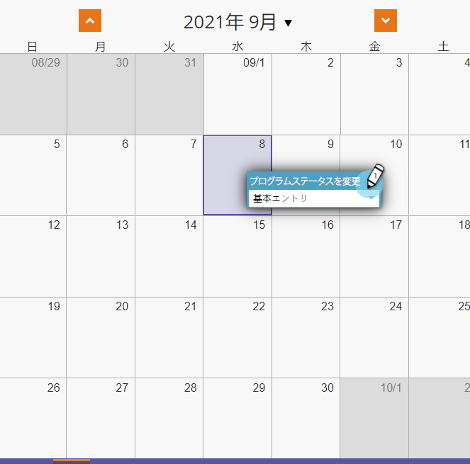
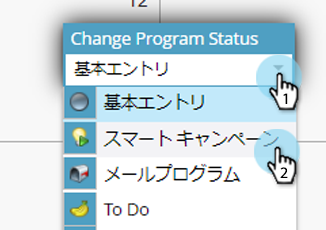
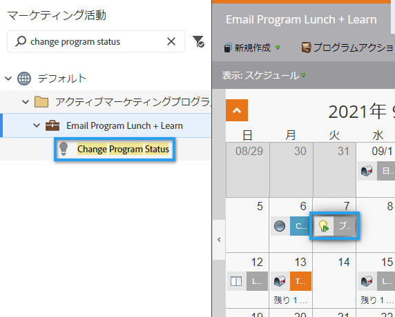
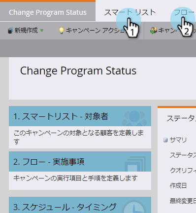
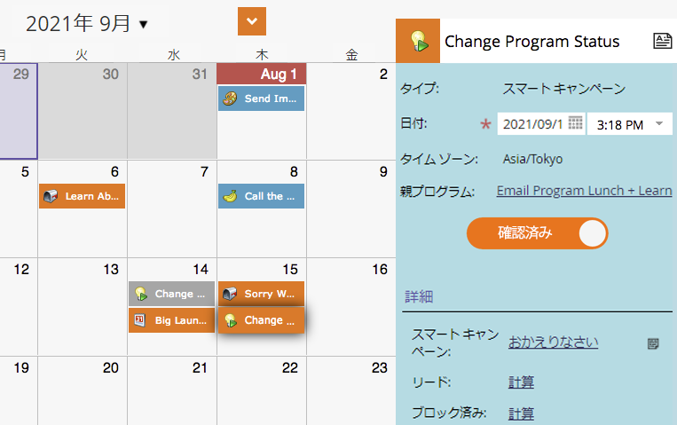

# プログラムスケジュールビューでのバッチスマートキャンペーンの作成 {#creating-a-batch-smart-campaign-in-the-program-schedule-view}

プログラム スケジュール ビューから、プログラム内で新しいスマートキャンペーンを作成し、既存のキャンペーンを[再実行できます](/help/marketo/product-docs/core-marketo-concepts/programs/program-schedule-view/rerun-a-smart-campaign-in-the-program-schedule-view.md){target="_blank"}。

>[!NOTE]
>
>このビューでは、バッチキャンペーンのみを作成できます。 トリガーキャンペーンはサポートされていません。

1. 新しいスマートキャンペーンを実行する日付を選択します。

   

1. エントリの名前を選択します。これは、新しいスマートキャンペーンになります。 **[!UICONTROL Enter／Return]** キーを押して名前を確定します。

   

1. 「**[!UICONTROL タイプ]**」ドロップダウンをクリックし、「**[!UICONTROL スマートキャンペーン]**」を選択します。

   

   >[!NOTE]
   >
   >ドロップダウンから選択して、既存のスマートキャンペーンを実行することもできます。

   

1. [ スマートキャンペーン ](/help/marketo/product-docs/core-marketo-concepts/smart-campaigns/creating-a-smart-campaign/create-a-new-smart-campaign.md){target="_blank"} ルールを選択します。

   

1. スケジュール表示とエントリの詳細で、このスマートキャンペーンが確認できるようになりました。

   

これにより、プログラムで新しいスマートキャンペーンを実行できるようになります。
