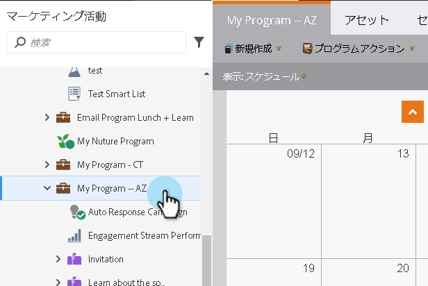
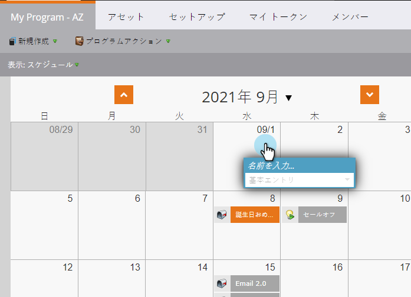
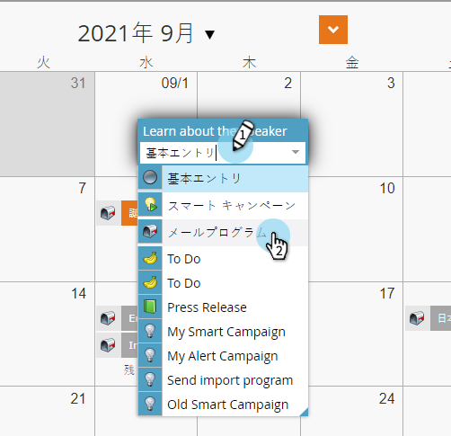
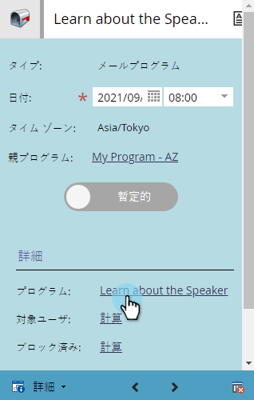
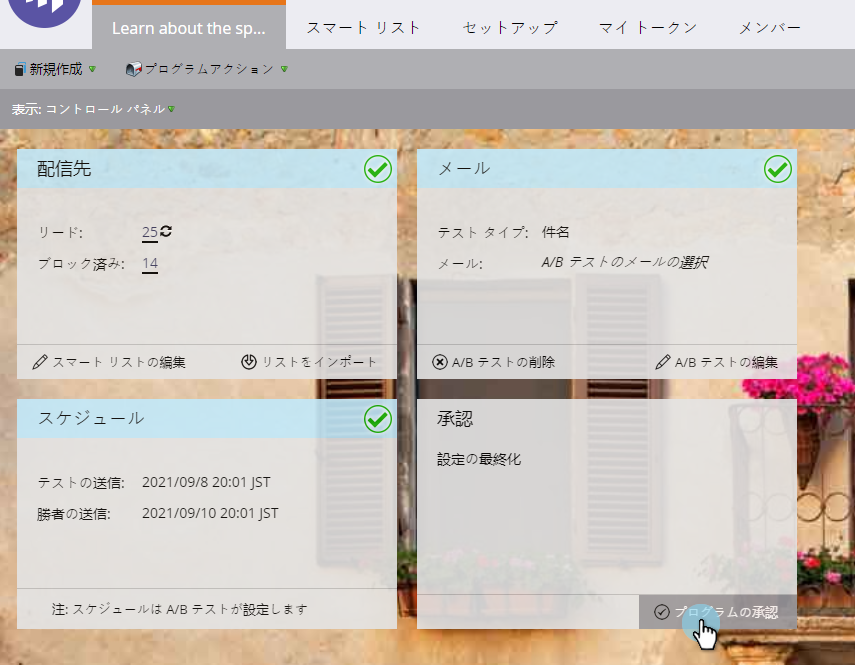

# スケジュール表示での新しい電子メールプログラムの作成{#creating-a-new-email-program-in-the-schedule-view}

プログラムスケジュール表示内から電子メールプログラムを作成できます。 これが方法です。

1. **マーケティングアクティビティ**&#x200B;に移動します。

   

1. プログラムを選択します。

   

1. 電子メールプログラムの実行日を選択します。

   

1. 名前を入力します。 「**電子メールプログラム**」を選択します。

   

1. 参加者の詳細で、新しい電子メールプログラムへのリンクをクリックします。

   

1. [電子メール](/help/marketo/product-docs/email-marketing/email-programs/creating-an-email-program/create-an-email-program.md) プログラムを設定し、「プログラムの **承認**」をクリックします。

   

   詳細なダッシュボードの他に、スマートキャンペーンの代わりに[電子メールプログラム](/help/marketo/product-docs/email-marketing/email-programs/creating-an-email-program/understanding-email-programs.md)を使用する利点は、[A/Bテスト](/help/marketo/product-docs/email-marketing/email-programs/email-program-actions/email-test-a-b-test/add-an-a-b-test.md)を簡単に実装できることです。 楽しんで！
