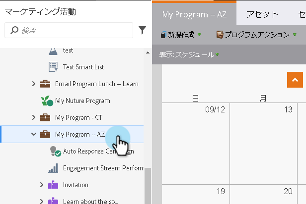
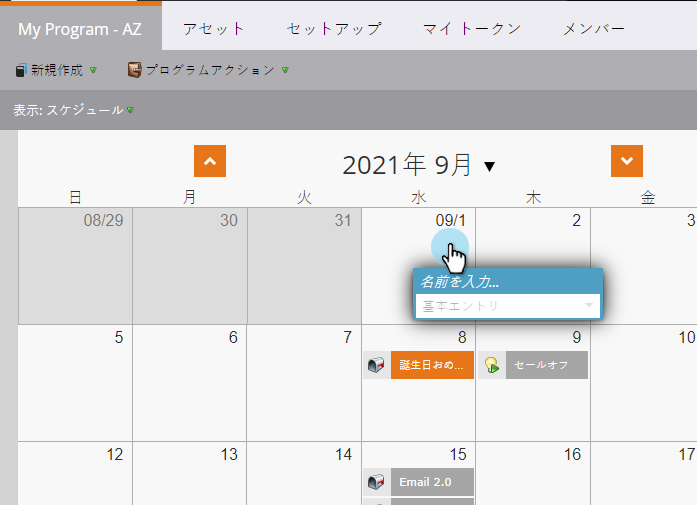
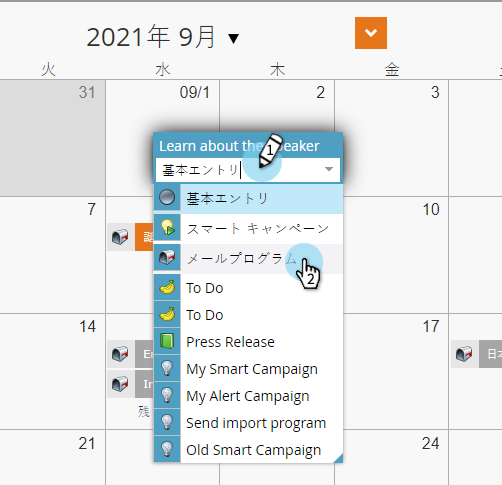
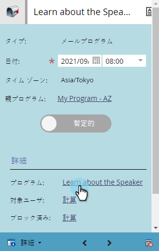
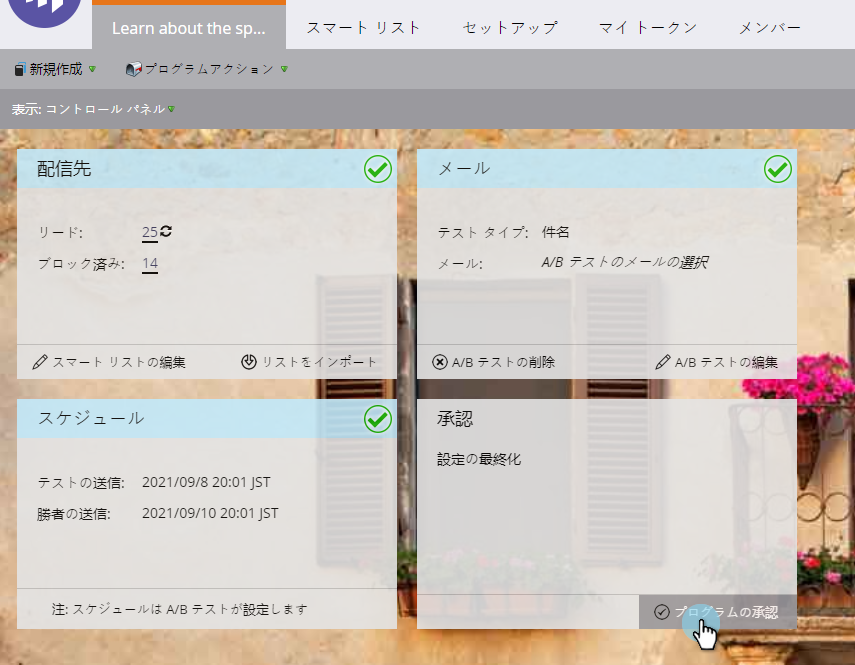

# スケジュール表示での新しいメールプログラムの作成 {#creating-a-new-email-program-in-the-schedule-view}

プログラムのスケジュール表示内からメールプログラムを作成できます。ここでは、その方法を説明します。

1. **[!UICONTROL マーケティングアクティビティ]**&#x200B;に移動します。

   

1. プログラムを選択します。

   

1. メールプログラムを実行する日付を選択します。

   

1. 名前を入力します。「**[!UICONTROL メールプログラム]**」を選択します。

   

1. エントリの詳細で、新しいメールプログラムへのリンクをクリックします。

   

1. [メールプログラムを設定](/help/marketo/product-docs/email-marketing/email-programs/creating-an-email-program/create-an-email-program.md){target="_blank"}して、「**[!UICONTROL プログラムを承認]**」をクリックします。

   

   スマートキャンペーンではなく[メールプログラム](/help/marketo/product-docs/email-marketing/email-programs/creating-an-email-program/understanding-email-programs.md){target="_blank"}を使用する理由は、使いやすいダッシュボードと、[A/B テスト](/help/marketo/product-docs/email-marketing/email-programs/email-program-actions/email-test-a-b-test/add-an-a-b-test.md){target="_blank"}を簡単に実施できる点にあります。お試しください。
