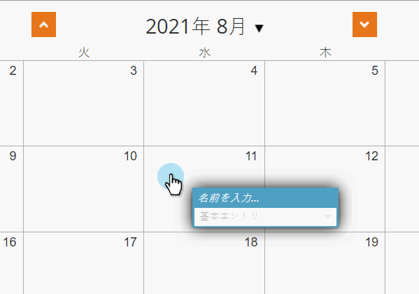
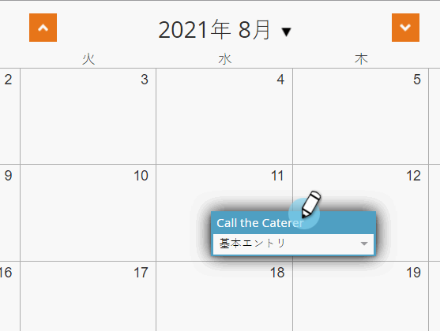
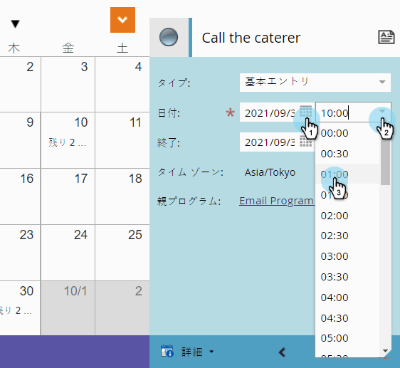
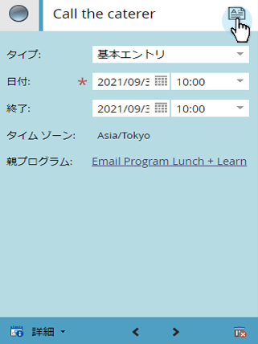
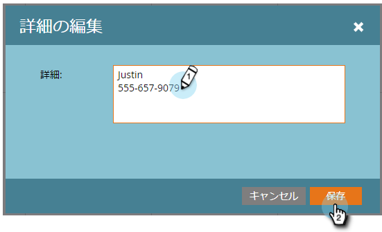
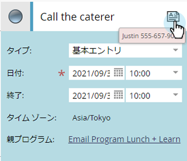
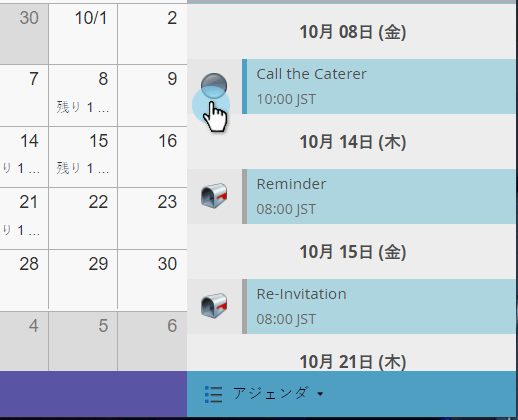
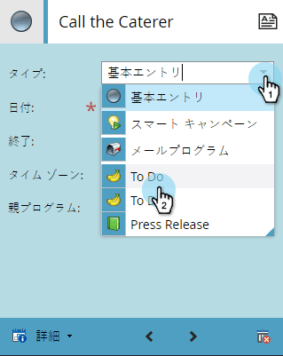
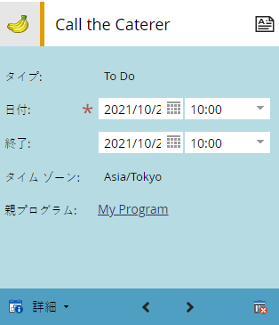

# プログラムスケジュール表示でのエントリの作成{#creating-an-entry-in-the-program-schedule-view}

既存のプログラムを補完するエントリをプログラムスケジュール表示内から作成できます。

## 基本エントリの作成{#create-a-basic-entry}

1. **マーケティングアクティビティ**&#x200B;に移動します。

   

1. プログラムを選択します。 **表示**&#x200B;ドロップダウンをクリックします。 **スケジュール**&#x200B;を選択します。

   

1. エントリを追加する日をクリックします。

   

1. エントリに名前を付けます。 **Enter **を押して名前を確定します。

   

1. 新しい参加者の開始と終了日時を選択します。

   

1. 詳細情報を追加するには、説明アイコンをクリックします。

   

1. 説明を入力し、「**保存**」をクリックします。

   

1. 説明アイコンの上にカーソルを置くと、エントリの説明が表示されます。

   

## エントリタイプの変更{#change-entry-type}

1. **議題**&#x200B;表示から基本的な項目を選択します。

   

1. 「**タイプ**」ドロップダウンを選択します。 新しいエントリタイプを選択します。

   >[!NOTE]
   >
   >TODOは[カスタムエントリ](create-custom-entry-types.md)です。 To Doやその他のカスタムエントリを作成して、マーケティング担当者以外の議題を追跡するのに役立てることができます。

   

   クール！ 変更はすぐに表示されます。

   

>[!NOTE]
>
> また、スケジュール表示から[スマートキャンペーン](creating-a-batch-smart-campaign-in-the-program-schedule-view.md)または[電子メールプログラム](creating-a-new-email-program-in-the-schedule-view.md)を作成することもできます。

