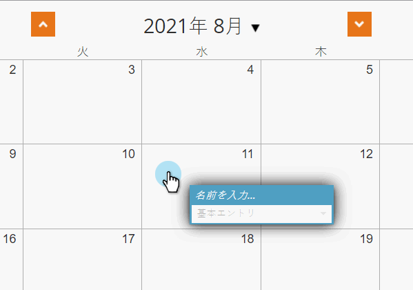
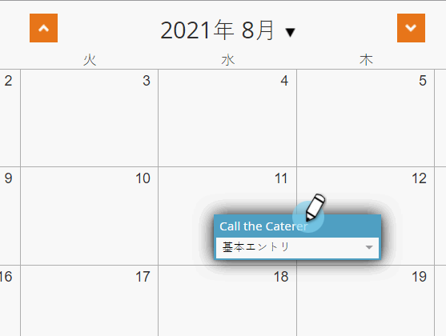
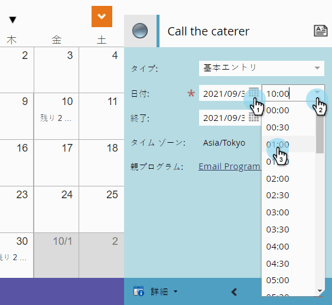
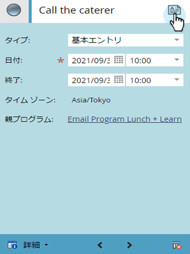
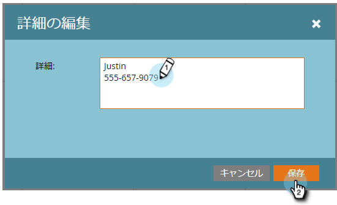
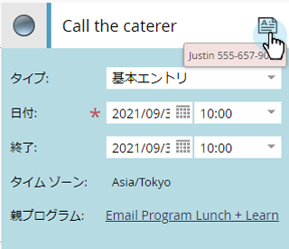
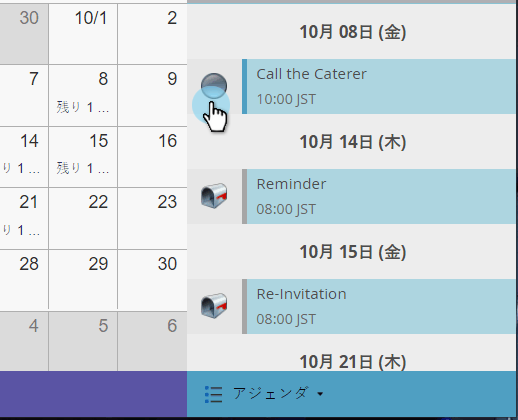
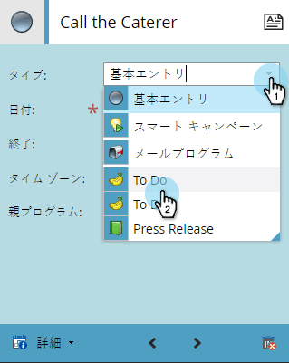
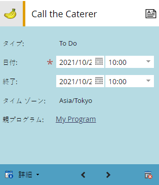

# プログラムスケジュールビューでのエントリの作成 {#creating-an-entry-in-the-program-schedule-view}

プログラムスケジュール表示内からエントリを作成して、既存のプログラムを補うことができます。

## 基本エントリの作成 {#create-a-basic-entry}

1. **[!UICONTROL マーケティングアクティビティ]**&#x200B;に移動します。

   

1. プログラムを選択します。 「**[!UICONTROL 表示]**」ドロップダウンをクリックします。 「**[!UICONTROL スケジュール]**」を選択します。

   

1. 日付をクリックして、エントリを追加します。

   

1. エントリに名前を付けます。 **[!UICONTROL Enter]** キーを押して名前を確定します。

   

1. 新規エントリの開始日時と終了日時を選択します。

   

1. さらに情報を追加するには、詳細アイコンをクリックします。

   

1. 詳細を入力して「**[!UICONTROL 保存]**」をクリックします。

   

1. 詳細アイコンにカーソルを合わせると、エントリの詳細が表示されます。

   

## エントリタイプの変更 {#change-entry-type}

1. **[!UICONTROL アジェンダ]**&#x200B;表示から基本エントリを選択します。

   

1. 「**[!UICONTROL タイプ]**」ドロップダウンを選択します。 新しいエントリタイプを選択します。

   >[!NOTE]
   >
   >「To-do」は[カスタムエントリ](/help/marketo/product-docs/core-marketo-concepts/programs/program-schedule-view/create-custom-entry-types.md){target="_blank"}です。 カスタムエントリは Marketo 以外のアジェンダをトラックするために作成できます。

   

   変更内容はすぐに表示されます。

   

>[!NOTE]
>
> スケジュールビューからは[スマートキャンペーン](/help/marketo/product-docs/core-marketo-concepts/programs/program-schedule-view/creating-a-batch-smart-campaign-in-the-program-schedule-view.md){target="_blank"}や[メールプログラム](/help/marketo/product-docs/core-marketo-concepts/programs/program-schedule-view/creating-a-new-email-program-in-the-schedule-view.md){target="_blank"}も作成できます。
