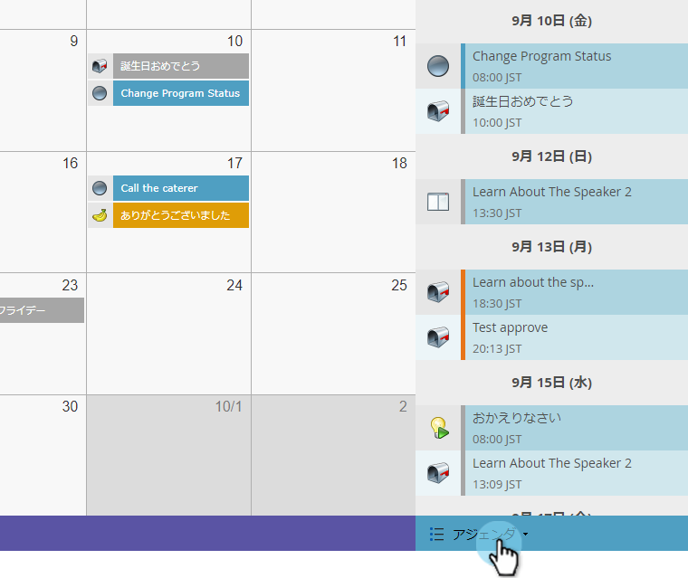
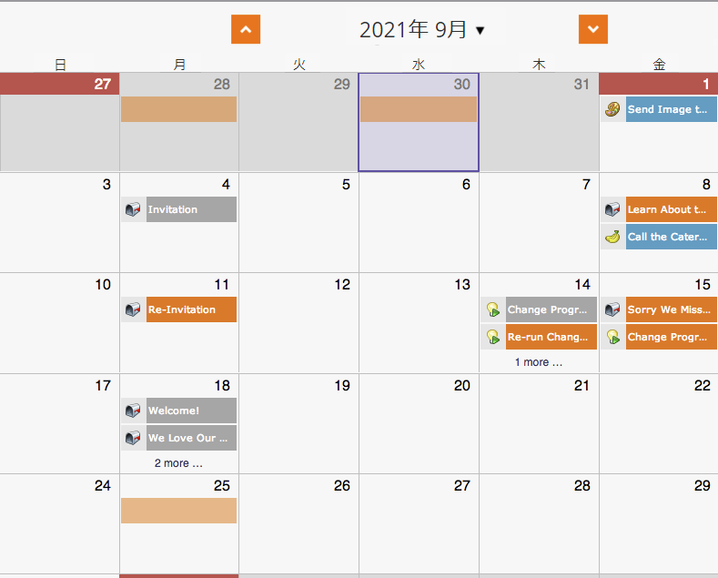

# プログラムスケジュール表示でのカスタムオーバーレイの作成{#creating-custom-overlays-in-program-schedule-view}

必要に応じて、表示エントリに対してカスタムオーバーレイを作成できます。

1. **アジェンダ**&#x200B;ドロップダウンをクリックします。

   

1. 「**オーバーレイ**」を選択します。

   

1. オーバーレイに表示するエントリのタイプを選択します。

   

1. また、[プログラムタグ](../../../../product-docs/core-marketo-concepts/programs/working-with-programs/understanding-tags/use-tags-in-a-program.md)でフィルタリングすることもできます。

   

   すごい。 現在は、オーバーレイには、定義したエントリのみが表示されます。

   

