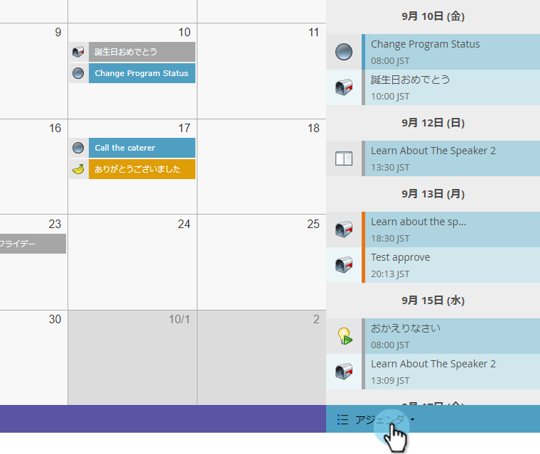
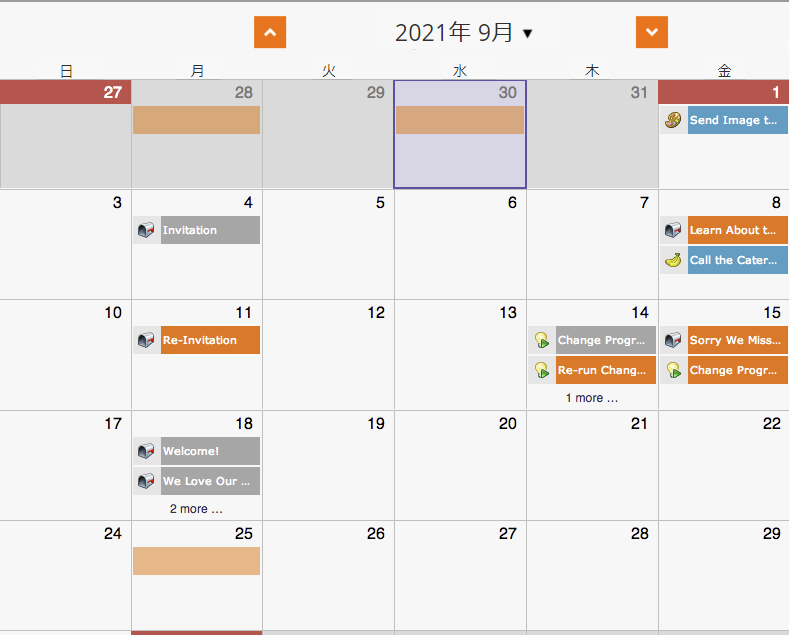

# カスタムオーバーレイの作成 {#creating-custom-overlays-in-program-schedule-view}

カスタムオーバーレイを作成すると、必要に応じたエントリを表示できます。

1. 「**[!UICONTROL アジェンダ]**」ドロップダウンをクリックします。

   

1. 「**[!UICONTROL オーバーレイ]**」を選択します。

   

1. オーバーレイで表示する[!UICONTROL エントリタイプ]を選択します。

   

1. 「[プログラムタグ](/help/marketo/product-docs/core-marketo-concepts/programs/working-with-programs/use-tags-in-a-program.md){target="_blank"}」でフィルターすることもできます。

   

   これで完了です。定義したエントリのみがオーバーレイに表示されるようになりました。

   
