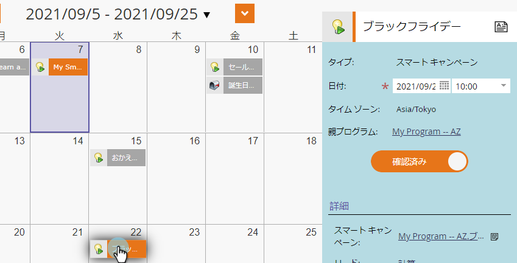
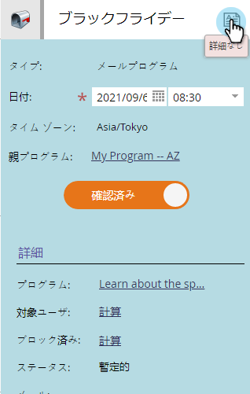
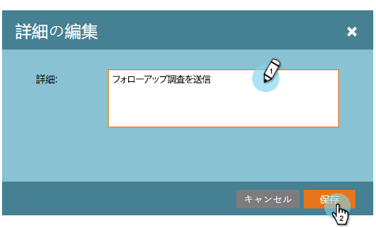
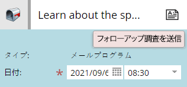
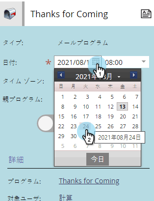

# プログラムスケジュール表示でのエントリの編集 {#editing-entries-in-the-program-schedule-view}

スケジュール表示で、プログラムの様々な要素に編集を加えることができます。

## 参加者名の編集 {#edit-an-entrys-name}

1. 編集するエントリを選択します。

   

1. 新しい名前を入力し、キーボードの **Enter/Return** キーを押して変更を確認します。

   

>[!CAUTION]
>
>これは、スケジュール表示の表示名を変更するだけです。 プログラムー内のアセットの名前は変更されません。

## 参加者の説明の編集 {#edit-an-entrys-description}

1. 説明アイコンをクリックします。

   

1. 説明を編集します。 「 **保存**」をクリックします。

   

1. 素晴らしい！ これで説明が変更されました。

   

## 参加者の日付の編集 {#edit-an-entrys-date}

1. 新しい日付を選択します。

   

揺れて！ 入力した日付が新しい日付に移動されました。

>[!NOTE]
>
> 既に実行されているスマートキャンペーンと電子メールプログラムのエントリは、過去のものには移動できません。

