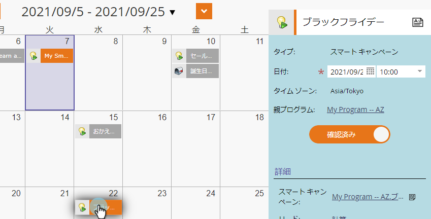
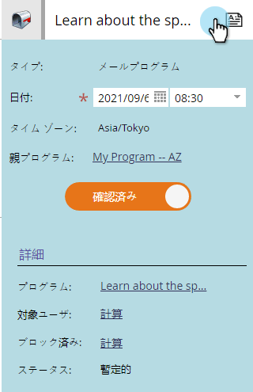
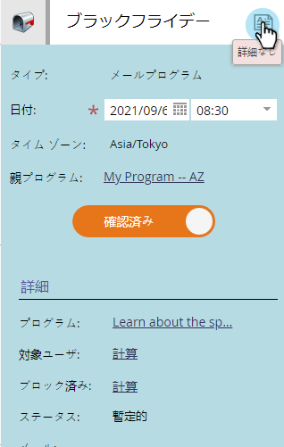
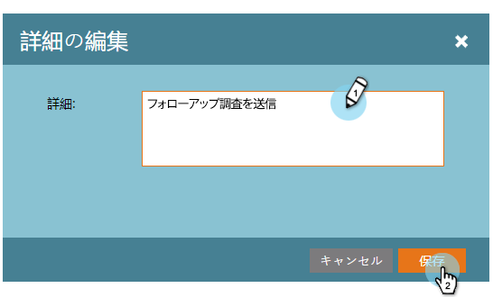
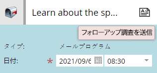
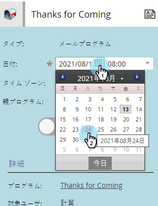

# プログラムスケジュール表示でのエントリの編集 {#editing-entries-in-the-program-schedule-view}

スケジュール表示では、プログラムの様々な要素を編集できます。

## エントリの名前の編集 {#edit-an-entrys-name}

1. 編集するオブジェクトを選択します。

   

1. 新しい名前を入力し、キーボードの **[!UICONTROL Enter/Return]** キーを押します。

   

>[!CAUTION]
>
>この操作で変更されるのは、スケジュール表示の表示名だけです。 プログラムのアセット名は変更されません。

## エントリの説明の編集 {#edit-an-entrys-description}

1. 説明アイコンをクリックします。

   

1. 説明を編集します。 「**[!UICONTROL 保存]**」をクリックします。

   

1. 説明が更新されました。

   

## エントリの日付の編集 {#edit-an-entrys-date}

1. 新しい日付を選択します。

   

エントリの日付が更新されました。

>[!NOTE]
>
> 既に実行されているスマートキャンペーンとメールプログラムのエントリを過去に移動することはできません。
