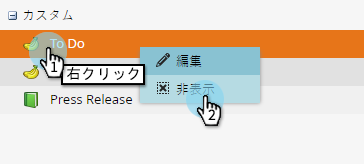
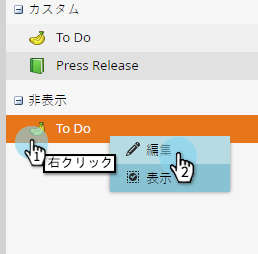
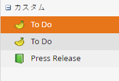

# カスタムエントリタイプの非表示と再表示 {#hiding-and-unhiding-custom-entry-types}

カスタムエントリタイプは、「管理者」セクションで非表示にできます。非表示にすると、エントリタイプはオプションとして表示されなくなります。

## カスタムエントリタイプの非表示 {#hide-a-custom-entry-type}

1. 「**管理者**」セクションに移動して、**カレンダーエントリ****タイプ**&#x200B;をクリックします。

   

1. カスタムエントリを右クリックし、「**非表示**」をクリックします。

   

   これで完了です。このエントリタイプは使用できなくなります。

## カスタムエントリタイプの再表示 {#unhide-a-custom-entry-type}

カスタムエントリタイプを再表示する場合も簡単です。

1. エントリを右クリックし、「**再表示**」を選択します。

   

   いかがでしょうか。カスタムエントリタイプは再表示されました。

   
