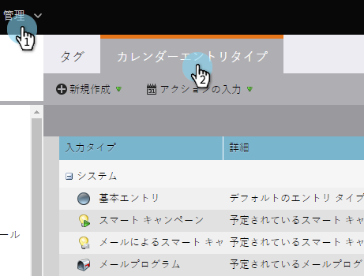
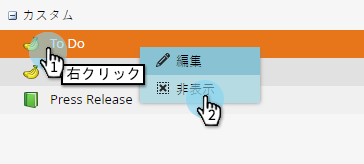
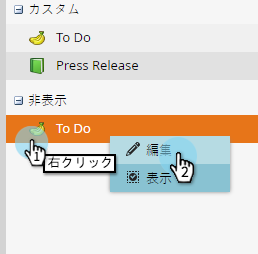
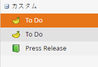

# カスタムエントリタイプの非表示と再表示 {#hiding-and-unhiding-custom-entry-types}

カスタムエントリタイプは、「管理者」セクションで非表示にできます。 非表示にすると、エントリタイプはオプションとして表示されなくなります。

## カスタムエントリタイプの非表示 {#hide-a-custom-entry-type}

1. **[!UICONTROL 管理者]** セクションに移動し、**[!UICONTROL カレンダーエントリタイプ]**&#x200B;をクリックします。

   

1. カスタムエントリを右クリックし、「**[!UICONTROL 非表示]**」をクリックします。

   

   このエントリタイプは使用できなくなります。

## カスタムエントリタイプの再表示 {#unhide-a-custom-entry-type}

カスタムエントリタイプを再表示するには：

1. エントリを右クリックし、「**[!UICONTROL 再表示]**」を選択します。

   

   カスタムエントリタイプが表示されます。

   
