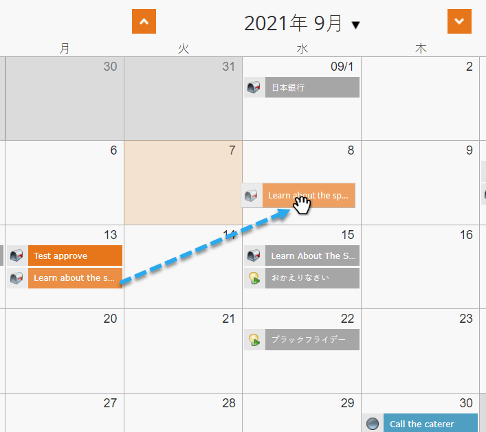
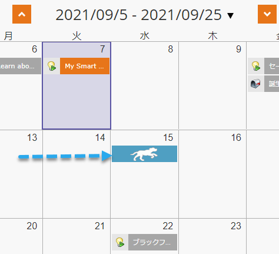
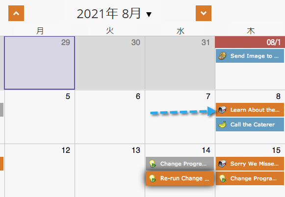

# プログラムスケジュール表示内のエントリの移動{#moving-entries-in-the-program-schedule-view}

スケジュール表示内のエントリを移動すると、自動的に再スケジュールされます。

>[!NOTE]
>
>既に実行されているスマートキャンペーン、アクションプログラム、またはメール送信は移動できません。

1. エントリを選択します。 別の日付にドラッグ&amp;ドロップします。

   

1. 次に、データ取得が承認を取り消し、日付を変更し、アセットを再承認します。 彼はそんな格好良い。

   

   うわあ！ 入力が再スケジュールされます。

   

