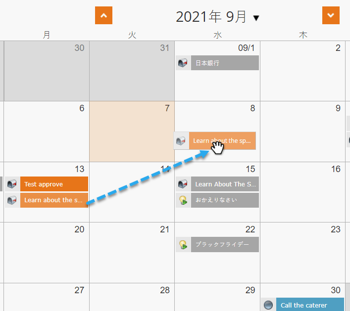
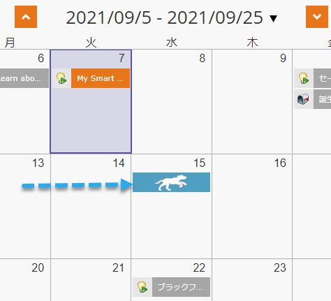
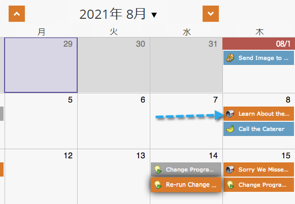

# プログラムスケジュール表示でのエントリの移動 {#moving-entries-in-the-program-schedule-view}

スケジュール表示でエントリを移動すると、そのエントリは自動的に再スケジュールされます。

>[!NOTE]
>
>スマートキャンペーン、エンゲージメントプログラム、メール一斉送信が既に実行済みの場合は、移動できません。

1. エントリを選択し、 別の日付までドラッグ＆ドロップします。

   

1. Marketoはアセットを自動的に承認および変更し、再度承認します。

   

   エントリが再スケジュールされました。

   
