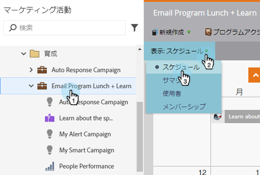
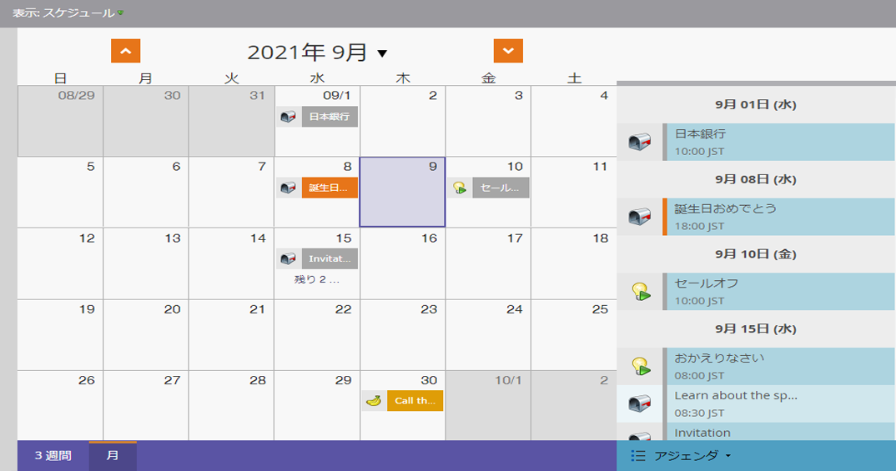
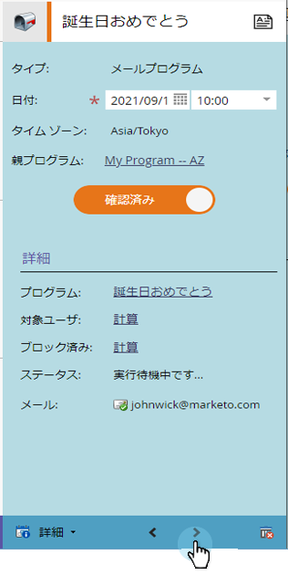
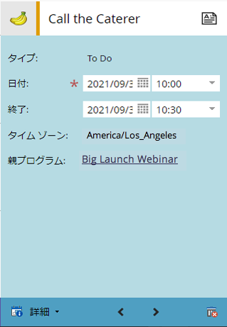
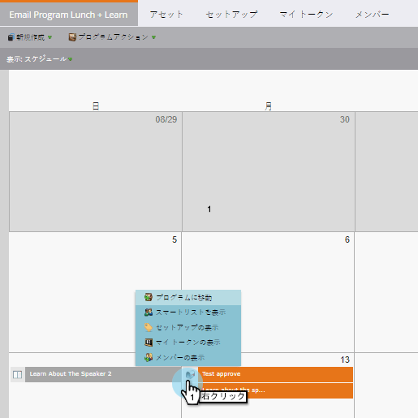
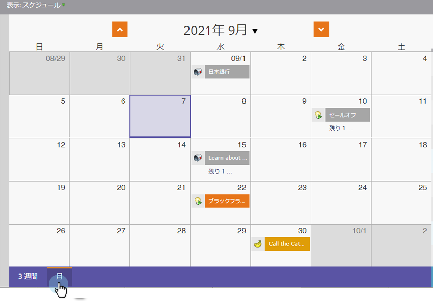
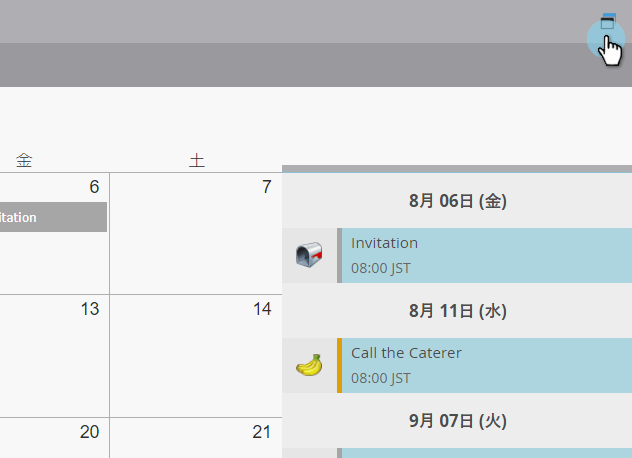

# プログラムスケジュール表示の操作{#navigating-the-program-schedule-view}

プログラムスケジュール表示を操作する際に役立つ基本事項を次に示します。

## スケジュール表示{#find-the-schedule-view}を探します。

1. **マーケティングアクティビティ**&#x200B;に移動します。

   

1. プログラムを選択します。 **表示**&#x200B;ドロップダウンをクリックします。 **スケジュール**&#x200B;を選択します。

   

   プログラムのスケジュール表示を確認します。

   

>[!NOTE]
>
>プログラムスケジュール表示は定着しています。 設定したプログラムは、すべてデフォルトでスケジュール表示に設定されます。

## エントリ間の切り替え{#switching-between-entries}

1. 参加者の詳細で、矢印をクリックすると、次に予定されている参加者に移動します。

   

   かっこいいだろ？

   

## 表示コンテキストメニュー{#view-context-menu}

1. 任意のプログラムを右クリックして、プログラム、スマートリスト、設定、マイトークン、またはメンバーに編集を行います。

   

## モード間の変更{#changing-between-modes}

1. 「**3週間**」または「**月**」をクリックすると、表示される日付が変更されます。

   

## フルスクリーン表示{#full-screen-view}

1. 画面アイコンを右上隅にクリックすると、プログラムスケジュールをフルスクリーンモードで表示できます。

   

素晴らしい！ プログラムを表示する方法を知ったら、他の素晴らしい方法を学びましょう。

>[!MORELIKETHIS]
>
>[プログラムスケジュール表示でのエントリの作成](/help/marketo/product-docs/core-marketo-concepts/programs/program-schedule-view/creating-an-entry-in-the-program-schedule-view.md)
