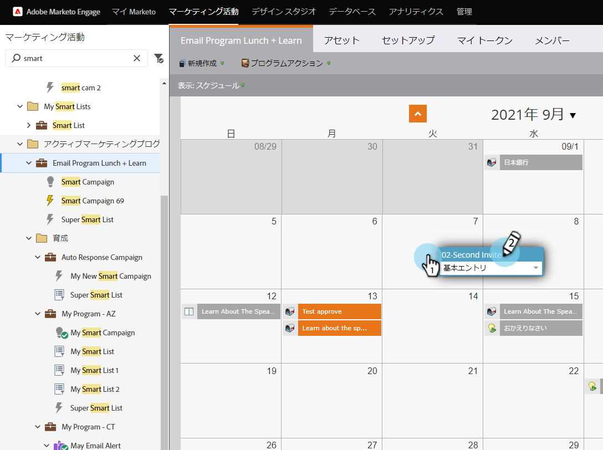
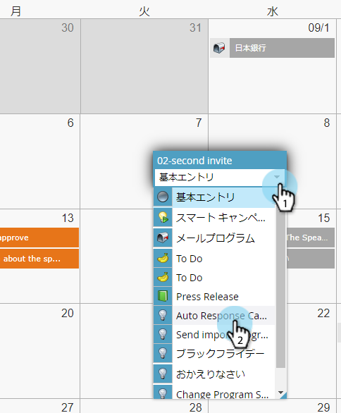

# プログラムスケジュール表示でスマートキャンペーンを再実行{#rerun-a-smart-campaign-in-the-program-schedule-view}

既存のスマートキャンペーンの新しい実行は、プログラムスケジュール表示から直接簡単に作成できます。

1. **マーケティングアクティビティ**&#x200B;に移動します。

   

1. スマートキャンペーンを含むプログラムを選択します。

   

1. スケジュール表示で、新しい実行日をクリックし、わかりやすい名前を入力します（「2回目の招待」など）。

   

1. エントリタイプメニューのドロップダウンを選択し、再実行するスマートキャンペーンを選択します。

   

   >[!TIP]
   >
   >これは、[プログラムフォーカス](/help/marketo/product-docs/core-marketo-concepts/marketing-calendar/understanding-the-calendar/understand-enable-program-focus.md)からも実行できます。

ブーム！ そのように、そのスマートキャンペーンに対して別の実行をスケジュールしました。 そのスマートキャンペーンにメール送信手順が含まれている場合は、それらも表示されます。
