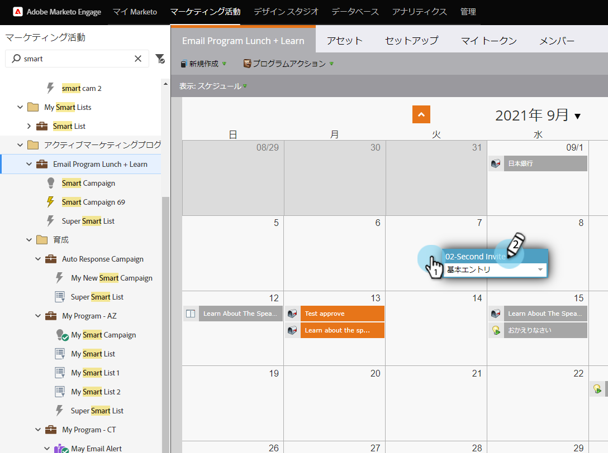
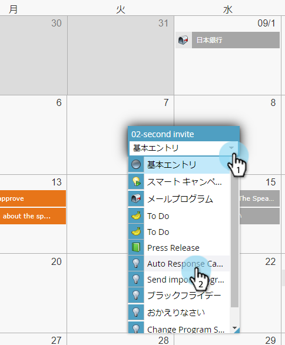

# プログラムスケジュール表示でのスマートキャンペーンの再実行 {#rerun-a-smart-campaign-in-the-program-schedule-view}

既存のスマートキャンペーンの新しい実行は、プログラムスケジュールビューから直接作成できます。

1. **[!UICONTROL マーケティングアクティビティ]**&#x200B;に移動します。

   

1. スマートキャンペーンを含むプログラムを選択します。

   

1. スケジュール表示で、新しい実行を設定する日をクリックし、エントリにわかりやすい名前を付けます（「2回目の招待」など）。

   

1. エントリタイプメニュードロップダウンを選択し、スマートキャンペーンを選択して再実行します。

   

   >[!TIP]
   >
   >また、「[プログラムフォーカス](/help/marketo/product-docs/core-marketo-concepts/marketing-calendar/understanding-the-calendar/understand-enable-program-focus.md)」からも実行できます。

スマートキャンペーンは、次の実行のためにスケジュールされています。 メール送信のステップが含まれている場合は、ここにも表示されます。
