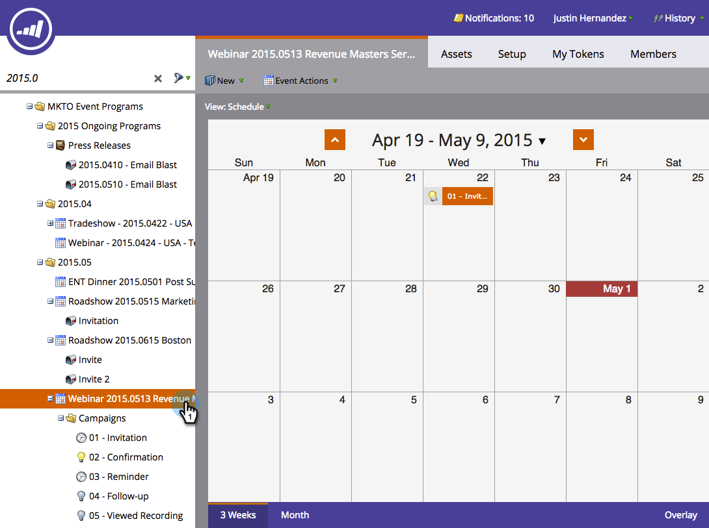

# プログラムスケジュール表示でのスマートキャンペーンの再実行 {#rerun-a-smart-campaign-in-the-program-schedule-view}

既存のスマートキャンペーンの新しい実行を、プログラムのスケジュールビューから直接簡単に作成できます。

1. 「**[!UICONTROL マーケティングアクティビティ]**」に移動します。

   

1. スマートキャンペーンを含むプログラムを選択します。

   

1. スケジュールビューで、新しい実行を設定する日をクリックし、わかりやすい名前（「2 回目の招待」など）を入力します。

   

1. エントリタイプメニューのドロップダウンを選択し、再実行するスマートキャンペーンを選択します。

   

   >[!TIP]
   >
   >また、「[プログラムフォーカス](/help/marketo/product-docs/core-marketo-concepts/marketing-calendar/understanding-the-calendar/understand-enable-program-focus.md)」からも実行できます。

いかがですか？同様に、そのスマートキャンペーンに対して別の実行をスケジュールしました。 そのスマートキャンペーンにメール送信手順が含まれている場合は、それらの手順も表示されます。
