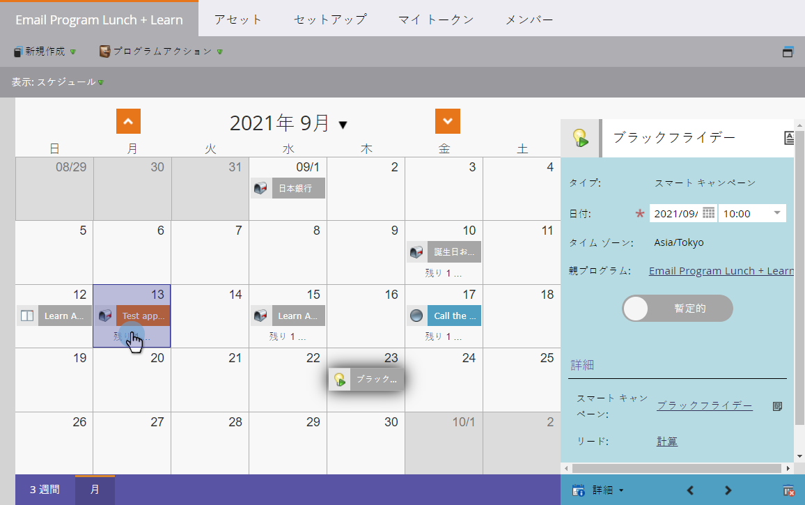
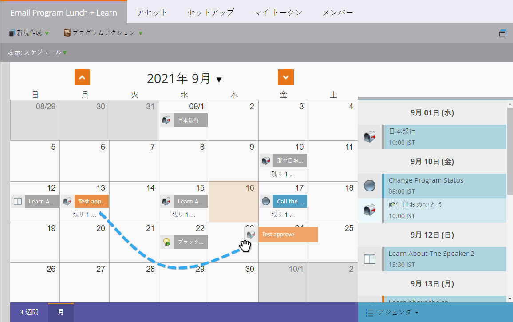
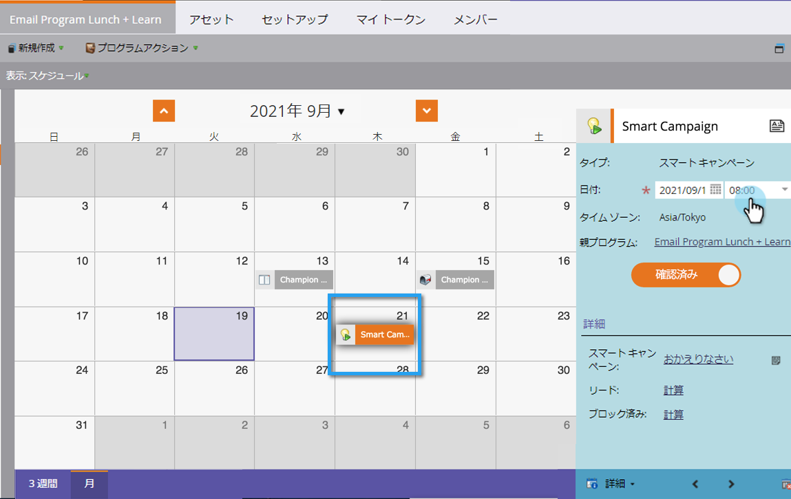

# プログラムスケジュール表示でのバッチスマートキャンペーンの再計画 {#reschedule-a-batch-smart-campaign-in-the-program-schedule-view}

バッチスマートキャンペーンの実行を再スケジュールしますか？ プログラムスケジュール表示の将来に向けてドラッグ&amp;ドロップします。

1. 再計画するスマートキャンペーンを選択します。

   

1. キャンペーンを実行する新しい日付にドラッグ&amp;ドロップします。 

1. 素晴らしい！ スマートキャンペーンが再スケジュールされました。 入口の詳細にある「 **日付** 」ドロップダウンから時刻を変更することもできます。

   

>[!NOTE]
>
>**関連記事**
>
>[計画表示からのプログラム全体の再計画](rescheduling-an-entire-program-from-the-schedule-view.md)

