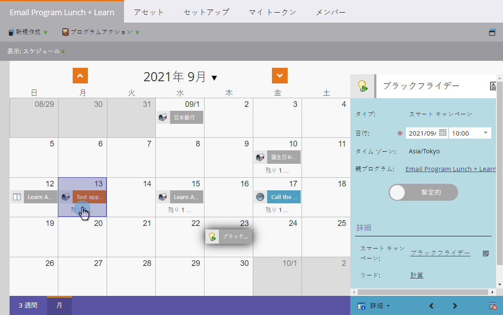
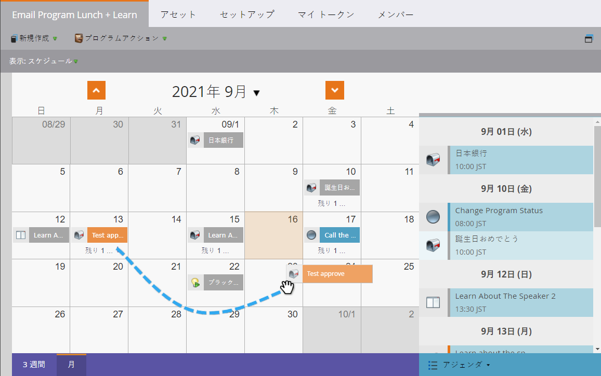
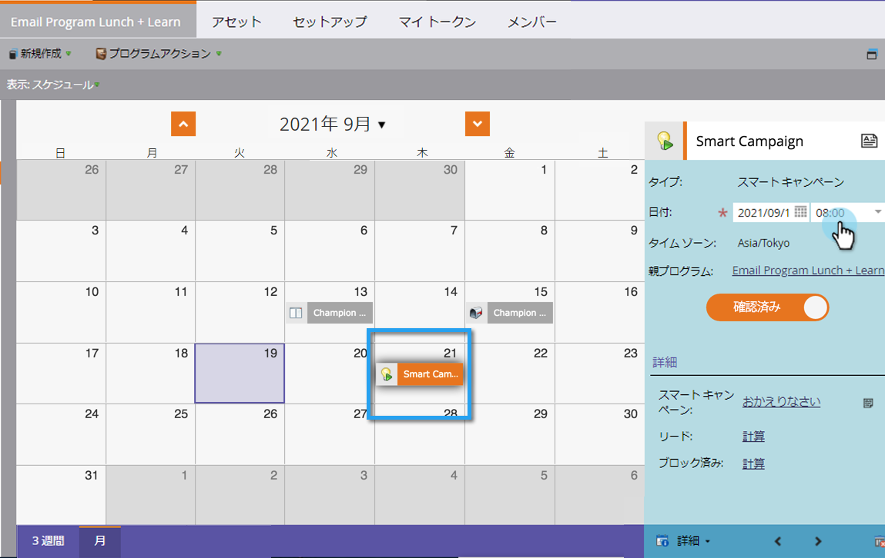

# プログラムスケジュール表示でのバッチスマートキャンペーンの再スケジュール {#reschedule-a-batch-smart-campaign-in-the-program-schedule-view}

バッチキャンペーン実行のスケジュールを変更する場合 プログラムスケジュール表示で未来にドラッグ&amp;ドロップします。

1. スケジュールを変更するスマートキャンペーンを選択します。

   

1. キャンペーンを実行する新しい日付にドラッグ&amp;ドロップします。

1. スマートキャンペーンのスケジュールが変更されました。 時刻は、エントリの詳細の「**[!UICONTROL 日付]**」ドロップダウンから変更することもできます。

   

>[!MORELIKETHIS]
>
>[スケジュール表示からのプログラム全体の再スケジュール](/help/marketo/product-docs/core-marketo-concepts/programs/program-schedule-view/rescheduling-an-entire-program-from-the-schedule-view.md){target="_blank"}
