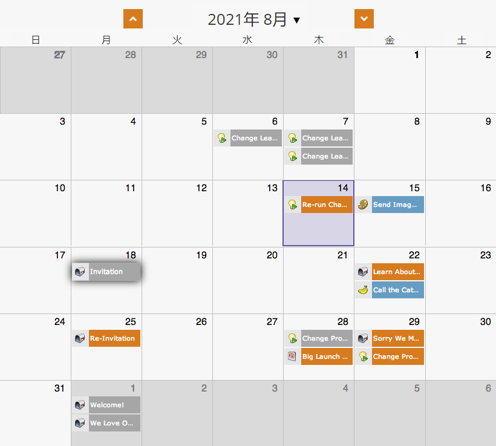

# 計画表示からのプログラム全体の再計画 {#rescheduling-an-entire-program-from-the-schedule-view}

日付を含むプログラムまたはイベントを複製した場合は、すべての日付を一度に再スケジュールする必要がある場合があります。 これが方法です。

1. 再計画するプログラムを選択します。

   

1. 「イベントアクション」ドロップダウンを選択します。 「入力の再計画」を選択します。

   

1. アンカーエントリを選択します。 この移動に基づいて、他のすべてのエントリも同時に移動します。

   

1. 新しい開始日を選択します。

   

1. 「再スケジュール」をクリックします。

   

1. ウー！ その後、データ取得者は、すべてのアセットを正しい日付で未承認にし、再スケジュールし、再承認します。

   

>[!NOTE]
>
>既に実行されているアセットは移動しません。

狂った！ 今は全てが再計画されている。 必要に応じて特定の日付を調整します。    

