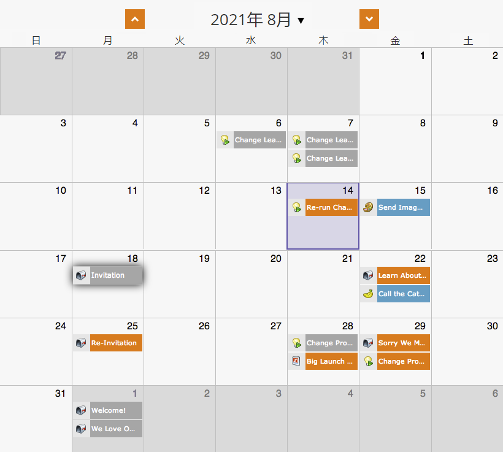

# スケジュール表示からのプログラム全体の再スケジュール {#rescheduling-an-entire-program-from-the-schedule-view}

日付を含むプログラムまたはイベントを複製するときに、すべての日付を一度に再スケジュールする場合、手順は次のとおりです。

1. 再スケジュールするプログラムを選択します。

   

1. 「イベントアクション」ドロップダウンを選択します。「**[!UICONTROL エントリの再スケジュール]**」を選択します。

   

1. 「[!UICONTROL アンカーエントリ]」を選択します。この移動に基づいて、他のすべてのエントリも一緒に移動します。

   

1. [!UICONTROL 新しい開始日]を選択します。

   

1. 「**[!UICONTROL 再スケジュール]**」をクリックします。

   

1. データ取得者は、すべてのアセットを正しい日付で承認を取り消し、再スケジュールし、再承認します。

   

>[!NOTE]
>
>既に実行しているアセットは移動しません。

すべてが再スケジュールされました。必要に応じて特定の日付を調整します。

