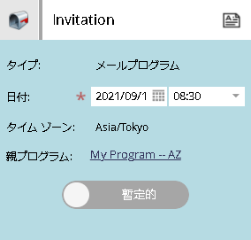
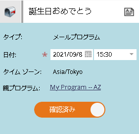
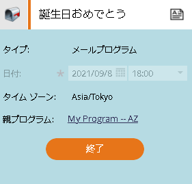

# 仮日/確認日について{#understanding-tentative-confirmed-dates}

スマートキャンペーンと電子メールプログラムには、**仮の**&#x200B;または&#x200B;**確認済み**&#x200B;としてマークする強力な機能があります。 これがその仕組みです

## 仮の{#tentative}

仮の日付は意図を表します。 これは、カレンダーの&#x200B;_ペンチリング_&#x200B;と考えてください。 仮の参加者は実行されません。仮の参加者はプレースホルダーのみです。

>[!NOTE]
>
>仮のスマートキャンペーンと電子メールプログラムのみを使用できます。

## エントリの確認{#confirming-entries}

これは、アセットの承認と同様なので、確認を行う前に、エントリを完全に設定する必要があります。 すべてのアヒルが一列に並ぶと、仮のタブを右にスライドして、参加者を確認できます。

>[!NOTE]
>
>なぜ犬が？ 彼は再審員です。 データを取得しています。

## 確認{#confirmed}

確認済みのエントリは必ず実行されます。 ルール、承認済みアセット、確認済みの日時が含まれます。

## {#finished}を終了

完了したエントリは既に実行されています。 過去のものしかない。 エントリが実行され、**完了**&#x200B;になったら、そのエントリを移動したり仮のエントリにしたりすることはできません。 （現実を変えず、時間流の連続体を妨げることはありません。）

これらの状態は強力なツールです。 プログラムを複製すると、スマートキャンペーンおよび電子メールのプログラム日はすべて仮の日付になります。 彼らは全員スケジュール表示から確認できる。 かっこいいだろ？
