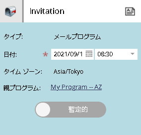
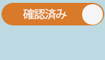
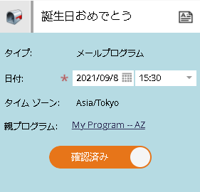
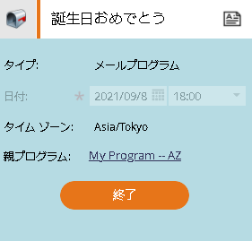

# 暫定的／確認済みの日付の理解 {#understanding-tentative-confirmed-dates}

スマートキャンペーンおよびメールプログラムには、**[!UICONTROL 暫定的]**&#x200B;または&#x200B;**[!UICONTROL 確認済み]**&#x200B;とマークするための優れた機能があります。 ここでは、その仕組みについて説明します。

## 暫定的 {#tentative}

暫定的な日付とは、その名前のとおりです。 カレンダーに&#x200B;_予定を鉛筆で書き込む_&#x200B;ようなものだと考えてください。 暫定的なエントリは、実行されることはなく、プレースホルダーとしてのみ意味を持ちます。

>[!NOTE]
>
>暫定的としてマークできるのは、バッチスマートキャンペーンとメールプログラムのみです。

## エントリの確認 {#confirming-entries}

アセットの承認と同様に、エントリを確認する前に設定を完全に済ませる必要があります。 準備が整ったら、「[!UICONTROL 暫定的]」タブを右にスライドさせることで、エントリを確認できます。

>[!NOTE]
>
>犬のマークはどういう意味なのでしょうか。 この犬はレトリバーで、 データを取りに行っているところです。

## 確認済み {#confirmed}

確認済みのエントリは、これから実行されることが決まっているエントリです。 ルール、承認済みのアセット、確認済みの日付と時刻が設定されています。

## 終了  {#finished}

終了したエントリは、既に実行済みのエントリです。 過去のものしかありません。 エントリが実行されて&#x200B;**[!UICONTROL 終了]**&#x200B;すると、そのエントリを移動したり、暫定的な状態に戻したりすることはできません。

これらのステートは、有用なツールとなります。 プログラムを複製するときは、すべてのスマートキャンペーンとメールプログラムの日付が暫定的になります。 これらの日付は、カレンダーから直接確認できます。
