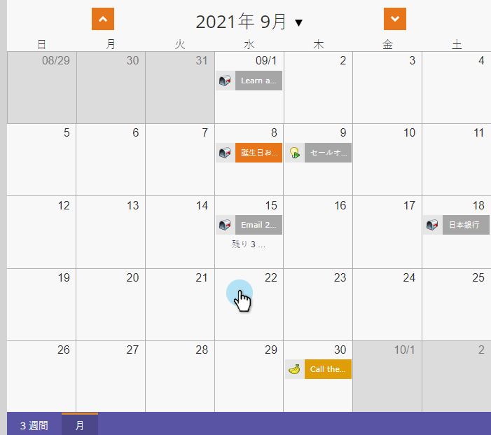
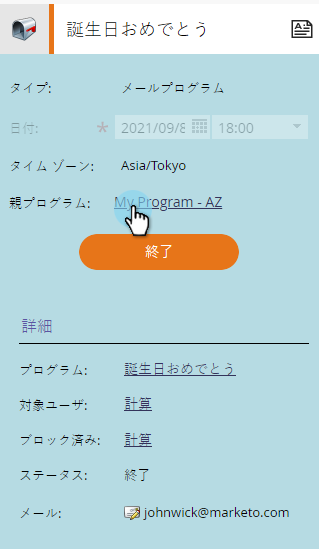

# グローバルオーバーレイの使用 {#using-a-global-overlay}

プログラムスケジュール表示のグローバルオーバーレイを使用すると、予定されている他のアセットとの関連プログラムを確認できます。

>[!PREREQUISITES]
>
>この機能を利用するには、 [マーケティングカレンダーライセンス](../../../../product-docs/core-marketo-concepts/marketing-calendar/understanding-the-calendar/issue-revoke-a-marketing-calendar-license.md) が必要です。

## グローバルオーバーレイの使用 {#use-the-global-overlay}

1. プログラムを選択します。

   

1. 右下隅の「 **オーバーレイ** 」を選択します。

   

1. 実線ブロックは、その日付のエントリを表します。 詳細を表示するには、をクリックします。

   

   オーバーレイ項目のエントリの詳細は読み取り専用になります。 親プログラムをクリックして変更を行います。

   

## 保存済みフィルターをオーバーレイとして使用する {#use-a-saved-filter-as-an-overlay}

マーケティングカレンダーにフィルターを [保存した場合](../../../../product-docs/core-marketo-concepts/marketing-calendar/working-with-the-calendar/saving-a-filter-definition-in-the-marketing-calendar.md)、プログラムスケジュール表示でオーバーレイとして使用できます。

1. 「 **オーバーレイ** 」ドロップダウンをクリックし、フィルター定義を選択します。

   

   簡単だ！ 保存して選択したフィルターで定義されたオーバーレイが表示されます。

   

   >[!NOTE]
   >
   >**関連記事**
   >
   >    
   >    
   >    * [プログラムスケジュール表示でのカスタムオーバーレイの作成](creating-custom-overlays-in-program-schedule-view.md)

