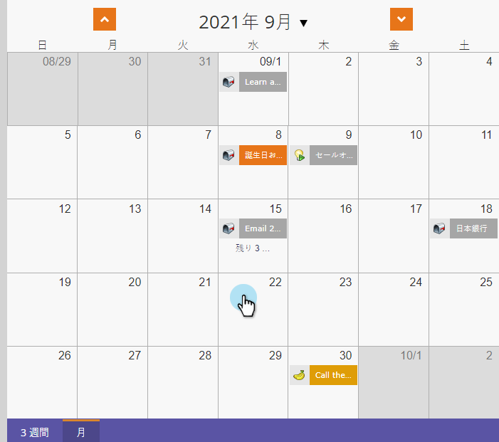
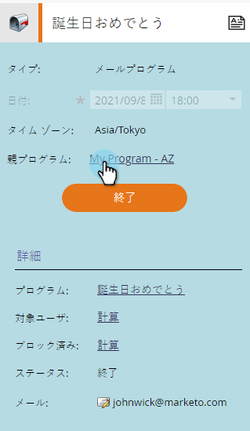

# グローバルオーバーレイの使用 {#using-a-global-overlay}

プログラムスケジュール表示でグローバルオーバーレイを使用すると、予定されている他のアセットと関連させてプログラムを見ることができます。

>[!PREREQUISITES]
>
>この機能を使用するには、[マーケティングカレンダーのライセンス](/help/marketo/product-docs/core-marketo-concepts/marketing-calendar/understanding-the-calendar/issue-revoke-a-marketing-calendar-license.md){target="_blank"}が付与されている必要があります。

## グローバルオーバーレイの使用 {#use-the-global-overlay}

1. プログラムを選択します。

   

1. 右下隅にある「**[!UICONTROL オーバーレイ]**」を選択します。

   

1. 塗りつぶしたブロックが、その日のエントリを表します。 クリックすると詳細が表示されます。

   

   オーバーレイ項目のエントリ詳細は、読み取り専用です。 変更するには親プログラムをクリックしてください。

   

## 保存されているフィルターをオーバーレイとして使用 {#use-a-saved-filter-as-an-overlay}

[マーケティングカレンダーでフィルターが保存されている](/help/marketo/product-docs/core-marketo-concepts/marketing-calendar/working-with-the-calendar/saving-a-filter-definition-in-the-marketing-calendar.md){target="_blank"}場合、それをプログラムスケジュール表示でオーバーレイとして使用できます。

1. 「**[!UICONTROL オーバーレイ]**」ドロップダウンをクリックし、フィルター定義を選択します。

   

   これで、保存されているフィルターを選択して定義したオーバーレイが表示されます。

   

   >[!MORELIKETHIS]
   >
   >[プログラムスケジュール表示でのカスタムオーバーレイの作成](/help/marketo/product-docs/core-marketo-concepts/programs/program-schedule-view/creating-custom-overlays-in-program-schedule-view.md){target="_blank"}
