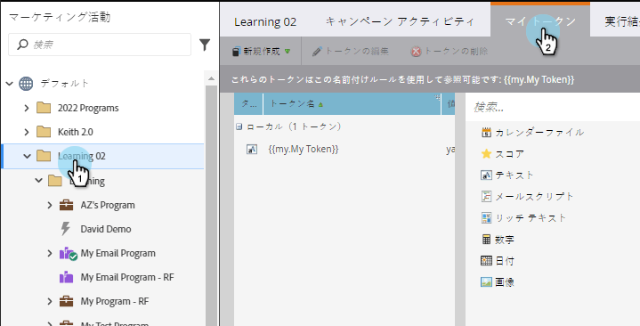
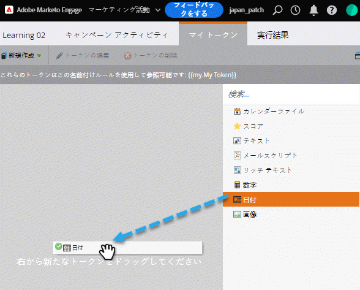
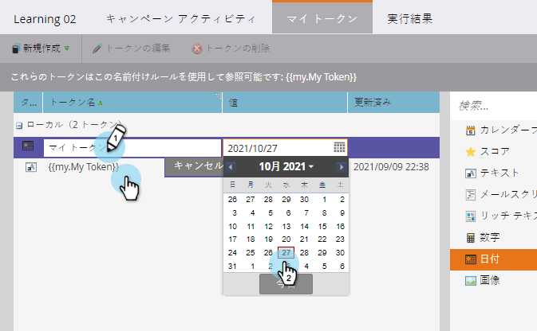
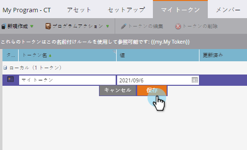
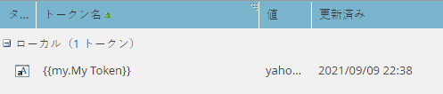
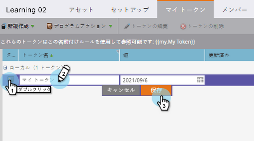
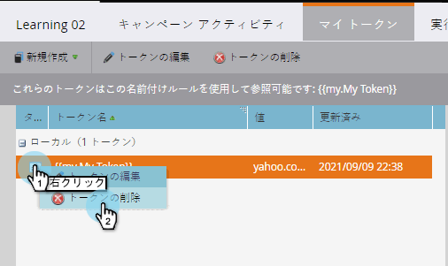
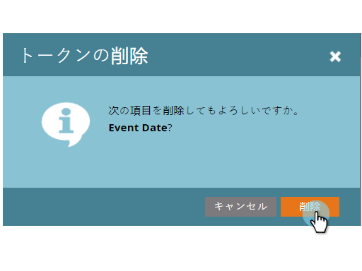

# マイトークンの管理{#managing-my-tokens}

トークンを使用すると、Marketoの取り組みを簡略化できます。 [マイトークン](understanding-my-tokens-in-a-program.md)（カスタムトークン）は、フローステップ、Webフック、電子メール、ランディングページで使用できます。 作り方を見てみましょう

>[!TIP]
>
>[トークンの概要](../../../../product-docs/demand-generation/landing-pages/personalizing-landing-pages/tokens-overview.md)で既に使用可能なトークンの詳細を確認します。

## マイトークンの作成{#create-a-my-token}

1. **マーケティングアクティビティに移動します。**

   

1. プログラムまたはキャンペーンフォルダを選択します。 「**マイトークン」をクリックします。**

   

1. **マイトークン**&#x200B;のタイプを選択します。 キャンバスにドラッグ&amp;ドロップします。

   

1. 一意の名前を入力します。 トークンに関連する値を入力します。

   

1. 「**保存**」をクリックします。

   

   やった！ **マイトークンを作成しました。**

   

## マイトークンの編集{#edit-a-my-token}

1. **マイトークン**&#x200B;を重複クリックし、変更を加えます。 「**保存**」をクリックします。

   

## マイトークンの削除{#delete-a-my-token}

>[!CAUTION]
>
>マイトークンを削除する場合は、どのアセットでも参照していないことを確認してください。 削除すると、参照されている任意の場所に空白が表示されます。

1. **マイトークンを右クリックします。** 「トークンの **削除」を選択します。**

   

1. 「**削除」をクリックします。**

   

   >[!NOTE]
   >
   >**関連記事**
   >
   >    
   >    
   >    * [トークンの概要](../../../../product-docs/demand-generation/landing-pages/personalizing-landing-pages/tokens-overview.md)
   >    * [プログラム内のマイトークンについて](understanding-my-tokens-in-a-program.md)
   >    * [マイトークンでのURLの使用](../../../../product-docs/email-marketing/general/using-tokens/using-urls-in-my-tokens.md)

