# マイトークンの管理 {#managing-my-tokens}

トークンを使用すると、Marketo Engage での作業がシンプルになります。 フローステップ、web フック、メール、ランディングページで[マイトークン](/help/marketo/product-docs/core-marketo-concepts/programs/tokens/understanding-my-tokens-in-a-program.md){target="_blank"}（カスタムトークン）を使用できます。 マイトークンの作成方法は、以下のとおりです。

>[!TIP]
>
>あらかじめ使用できるトークンについては、[トークンの概要](/help/marketo/product-docs/demand-generation/landing-pages/personalizing-landing-pages/tokens-overview.md){target="_blank"}を参照してください。

## ローカルまたはグローバルなマイトークンを作成 {#create-a-my-token}

>[!BEGINTABS]

>[!TAB ローカルなマイトークン]

1. **[!UICONTROL マーケティングアクティビティ]**&#x200B;で、目的のプログラムまたはキャンペーンフォルダーを選択し、「**[!UICONTROL マイトークン]**」タブをクリックします。

   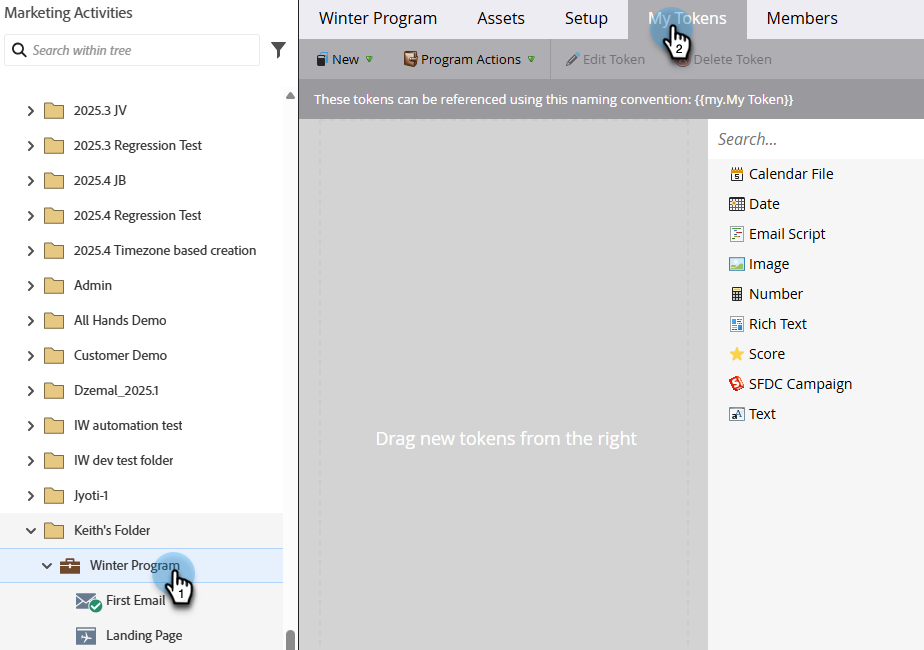

1. 目的のマイトークンをキャンバスにドラッグします。

   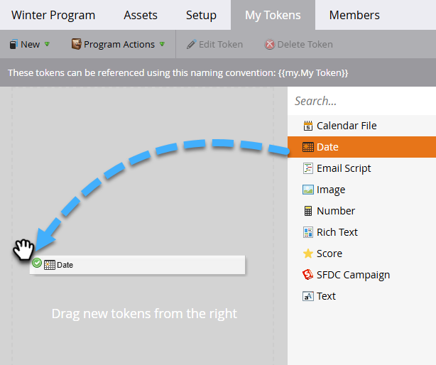

1. 一意の名前を入力し、関連する値を入力します。

   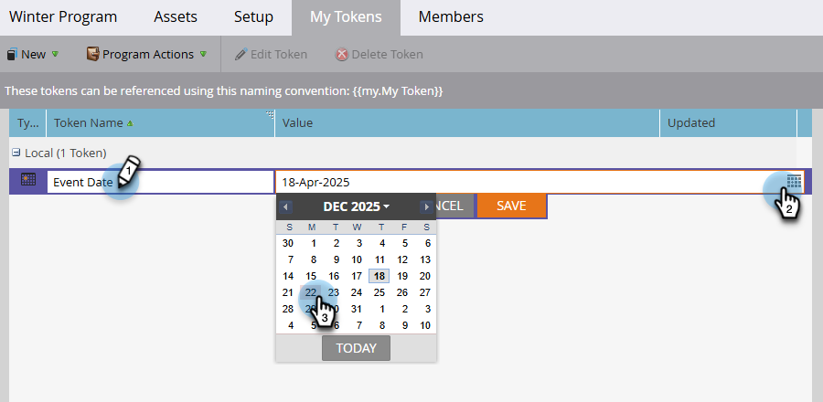

1. 「**[!UICONTROL 保存]**」をクリックします。

   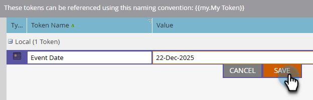

>[!TAB グローバルなマイトークン]

>[!NOTE]
>
>管理者権限は必須です。

1. **[!UICONTROL 管理者]**&#x200B;領域に移動し、「**[!UICONTROL マイトークン]**」を選択します。

   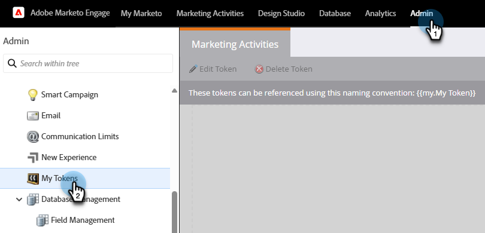

1. 目的のマイトークンをキャンバスにドラッグします。

   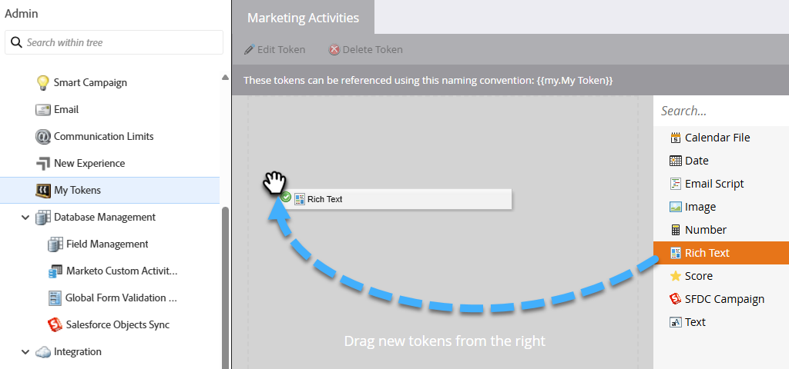

1. 一意の名前を入力し、関連する値を入力します。

   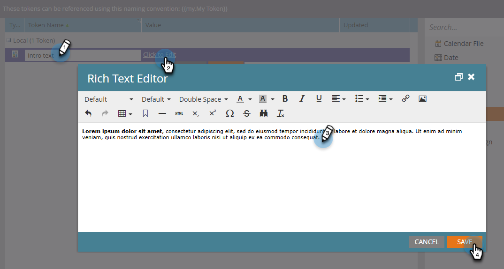

1. 「**[!UICONTROL 保存]**」をクリックします。

   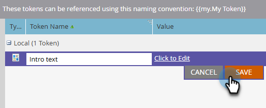

>[!ENDTABS]

## マイトークンを編集 {#edit-a-my-token}

1. 編集するトークンを選択し、「**[!UICONTROL トークンを編集]**」をクリックします。

   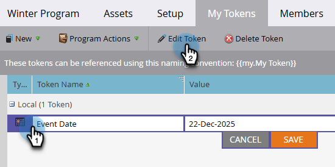

1. 目的の編集を行います。 終了したら「**[!UICONTROL 保存]**」をクリックします。

   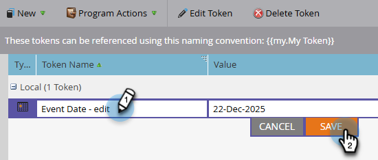

## マイトークンを削除 {#delete-a-my-token}

>[!CAUTION]
>
>マイトークンを削除する場合は、どのアセットでも現在参照されていないことを確認してください。 空白スペースは、削除すると、参照されている任意の場所に表示されます。

1. 削除するトークンを選択し、「**[!UICONTROL トークンを削除]**」をクリックします。

   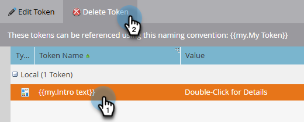

1. 「**[!UICONTROL 削除]**」をクリックします。

   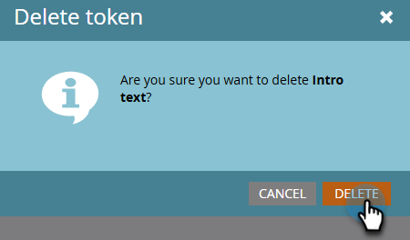

   >[!MORELIKETHIS]
   >
   >* [トークンの概要](/help/marketo/product-docs/demand-generation/landing-pages/personalizing-landing-pages/tokens-overview.md){target="_blank"}
   >* [プログラム内のマイトークンの理解](/help/marketo/product-docs/core-marketo-concepts/programs/tokens/understanding-my-tokens-in-a-program.md){target="_blank"}
   >* [マイトークンでの URL の使用](/help/marketo/product-docs/email-marketing/general/using-tokens/using-urls-in-my-tokens.md){target="_blank"}
