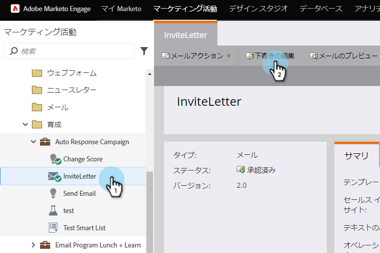
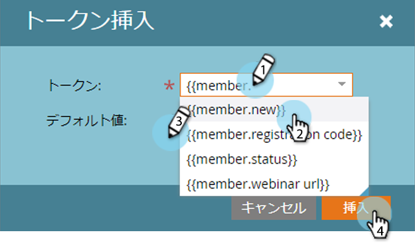
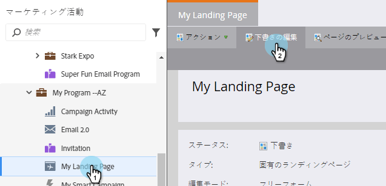
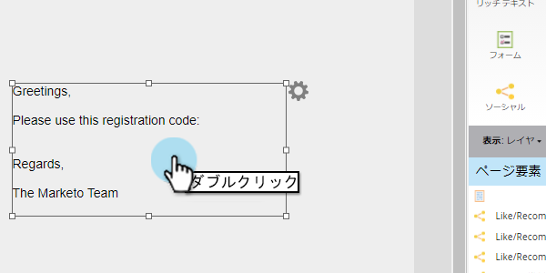
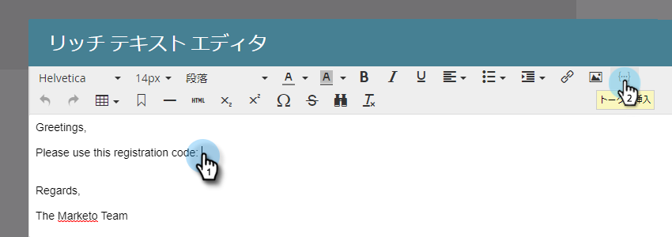
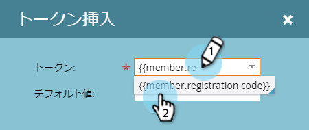
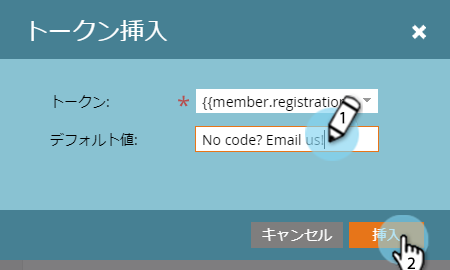
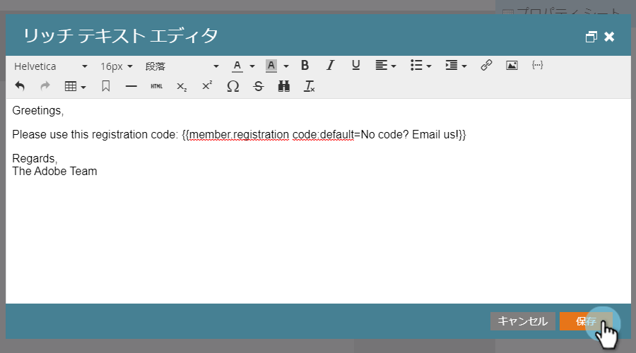
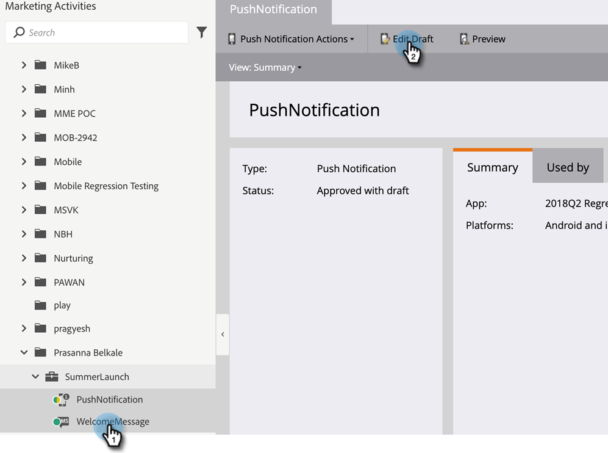

# プログラムメンバーカスタムフィールドトークン {#program-member-custom-field-tokens}

## プログラムメンバーカスタムフィールドのトークンサポート {#token-support-for-program-member-custom-fields}

プログラムメンバーカスタムフィールド機能の背後で、トークンフレームワークのプログラムメンバーカスタムフィールドに対するサポートが拡張されています。

PMCF トークンは、トークンファミリーのメンバードメインでサポートされます。

メンバートークンは、プログラムメンバーの範囲のフィールドに使用されます。現状では、メンバートークンは、統合サービスパートナーから一意の値を挿入するためにも使用されます。`{{member.webinar url}}` トークンは、サービスプロバイダーによって生成されたユーザーの一意の確認 URL を自動的に解決します。{{member.registration code}} は、サービスプロバイダーから提供された登録コードに解決されます。

>[!NOTE]
>
>* プログラムメンバーカスタムフィールドは、プログラムのコンテキストでのみ使用できます。
>* プログラムメンバーカスタムフィールドトークンは、メールのプリヘッダー、待機ステップの日付トークン、スニペットでは使用できません。
>* メンバートークンでは、プログラムメンバーステータスはサポートされていません。

## アセットでのプログラムメンバーカスタムフィールドトークンの使用 {#using-program-member-custom-field-tokens-in-assets}

プログラムメンバーカスタムフィールドトークンは、電子メール、ランディングページ、SMS メッセージ、プッシュ通知、web フックに挿入できます。

**メール**

1. 目的のメールを選択し、「**ドラフトを編集**」をクリックします。

   

1. 「トークンを挿入」アイコンをクリックします。

   

1. 目的のプログラムメンバーカスタムフィールドトークンを検索して選択し、デフォルト値を入力して、「**挿入**」をクリックします。

   

1. 「**保存**」をクリックします。

   

>[!NOTE]
>
>忘れずにメールを承認してください。

**ランディングページ**

1. ランディングページを選択し、「**ドラフトを編集**」をクリックします。

   

   >[!NOTE]
   >
   >ランディングページデザイナーが新しいウィンドウで開きます。

1. トークンを追加するリッチテキストボックスをダブルクリックします。

   

1. トークンを挿入する場所をクリックし、「トークンを挿入」アイコンをクリックします。

   

1. 目的のトークンを見つけて選択します。

   

1. デフォルト値を入力し、「**挿入**」をクリックします。

   

1. 「**保存**」をクリックします。

   

**SMS**

1. 目的の SMS を選択し、「**ドラフトを編集**」をクリックします。

   

1. 「**`{{ Token`**」ボタンをクリックします。

   

1. 目的のプログラムメンバーカスタムフィールドトークンを検索して選択します。デフォルト値を入力し、「挿入」をクリックします。

   

1. 「SMS アクション」ドロップダウンをクリックし、「**承認して閉じる**」を選択します。

   

**プッシュ通知**

1. 目的のプッシュ通知を選択し、「**ドラフトを編集**」をクリックします。

   

1. 「**プッシュ通知**」をクリックします。

   

1. エディターでメッセージをクリックし、「`{{`」ボタンをクリックしてトークンセレクターを取得します。

   

1. 目的のプログラムメンバーカスタムフィールドトークンを検索して選択します。デフォルト値を入力し、「**挿入**」をクリックします。

   

1. 「**完了**」をクリックして、保存して終了します（または「**次へ**」をクリックして最初にレビューします）。

   

>[!NOTE]
>
>プログラムのメンバーのプログラムメンバーカスタムフィールドに値がない場合、トークンはデフォルト値に置き換えられます（指定されている場合）。

## キャンペーンでのプログラムメンバーカスタムフィールドトークンの使用 {#using-program-member-custom-field-tokens-in-campaigns}

プログラムメンバーカスタムフィールドトークンは、次の場所で使用できます。

* タスクの作成
* Microsoft でのタスクの作成
* 注目のアクション
* データ値の変更フローアクション
* Web フック
