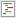
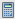
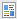

# プログラム内のマイトークンについて {#understanding-my-tokens-in-a-program}

トークンは、メール、ランディングページ、スマートキャンペーンで使用する変数で、これにより作業が手軽になります。

マイトークンに加えて、プログラム内で任意のビルトイントークンを使用することもできます。 [ トークンの概要](/help/marketo/product-docs/demand-generation/landing-pages/personalizing-landing-pages/tokens-overview.md){target="_blank"}を参照してください。

## マイトークン  {#my-tokens}

マイトークンは、誰でも作成できるカスタム変数です。 ローカルでは、これらは、キャンペーンフォルダーまたはプログラム内で[作成](/help/marketo/product-docs/core-marketo-concepts/programs/tokens/managing-my-tokens.md){target="_blank"}されます。

マイトークンは次のように表示されます。`{{my.Name Of Token}}`

例：

* `{{my.Event Date}}`
* `{{my.Webinar Speaker}}`

<table>
 <thead>
  <tr>
   <th>トークンのタイプ</th>
   <th>説明</th>
  </tr>
 </thead>
 <tbody>
  <tr>
   <td>カレンダーファイル </td>
   <td>このトークンを使用して、<a href="/help/marketo/product-docs/email-marketing/general/functions-in-the-editor/create-a-calendar-event-ics-file.md">カレンダーイベントファイル（.i</a><a href="/help/marketo/product-docs/email-marketing/general/functions-in-the-editor/create-a-calendar-event-ics-file.md">cs）</a>をメールとランディングページに追加します。</td>
  </tr>
  <tr>
   <td>
日 
</td>
   <td>このトークンは日付値を保持します。 日付は、年 - 月 - 日（例：2016-05-23）と表示されます。</td>
  </tr>
  <tr>
   <td>メールスクリプト </td>
   <td>このトークンを使用すると、メール内で Velocity スクリプトを実行できます。 詳細は<a href="https://experienceleague.adobe.com/ja/docs/marketo-developer/marketo/email-scripting" title="リンク先" rel="nofollow">こちら</a>を参照してください。 </td>
  </tr>
  <tr>
   <td>数字 </td>
   <td>任意の整数。 マイナスになることもあります。</td>
  </tr>
  <tr>
   <td>リッチテキスト </td>
   <td>これは HTML です。 メールとランディングページで使用します。</td>
  </tr>
  <tr>
   <td>スコア </td>
   <td>このトークンを、<a href="/help/marketo/product-docs/core-marketo-concepts/smart-campaigns/flow-actions/use-tokens-in-flow-steps.md">スコアの変更フローステップ</a>で使用します。 </td>
  </tr>
  <tr>
   <td colspan="1">SFDC キャンペーン </td>
   <td colspan="1">このトークンを使用すると、Marketo プログラムの一部となったリードを、指定された SFDC キャンペーンにも追加できます。</td>
  </tr>
  <tr>
   <td>テキスト </td>
   <td>テキストです。 HTML が過剰な場合に使用します。 テキストトークンのサイズ制限は 524,288 文字（UTF-8）または 2 MB です。</td>
  </tr>
 </tbody>
</table>

>[!CAUTION]
>
>[!DNL Microsoft Dynamics] または [!DNL Salesforce] のセールスインサイトからメールを送信しても、マイトークンは解決されません。標準のトークン（リード、会社など）のみが入力されます。 ただし、トークンのデフォルト値は&#x200B;_機能します_。

## トークンのネスト {#nesting-tokens}

新しいトークンを作成すると、そのトークンをツリー内の他のオブジェクトで参照できます。 管理を容易にするために、トークンがどこで作成されたかに基づく命名構造が用意されています。

* **ローカルトークン：**&#x200B;そのプログラムまたはフォルダーで適切に作成されたトークン。
* **継承されたトークン：**&#x200B;ツリーの上位のプログラムまたはフォルダーの任意の場所に作成されたトークン。
* **上書きされたトークン：**&#x200B;継承された後に、このプログラムまたはフォルダーでは例外とされたトークン。

グローバル変数を作成して、ツリーの下位レベルで上書きできます。

プログラムやフォルダーの移動はトークンにも影響を与えます。 移動するときに参照が壊れていないことを必ず確認してください。

>[!IMPORTANT]
>
>ネストされたトークンは、[ バッチキャンペーン ](/help/marketo/product-docs/core-marketo-concepts/smart-campaigns/creating-a-smart-campaign/understanding-batch-and-trigger-smart-campaigns.md#batch-campaign){target="_blank"}ではサポートされていません。

>[!NOTE]
>
>エンゲージメントプログラムから送信したメールがデフォルトプログラムの子メールの場合（エンゲージメントプログラムのローカルメールではない場合）、メールで使用されるマイトークンは、その子メールが存在するデフォルトプログラムから参照されます。

>[!MORELIKETHIS]
>
>* [トークンの概要](/help/marketo/product-docs/demand-generation/landing-pages/personalizing-landing-pages/tokens-overview.md){target="_blank"}
>* [マイトークンの管理](/help/marketo/product-docs/core-marketo-concepts/programs/tokens/managing-my-tokens.md){target="_blank"}
