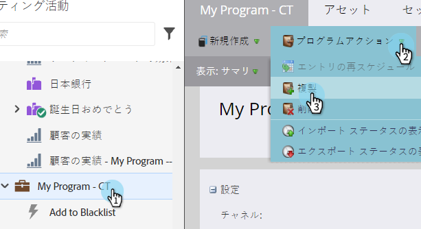
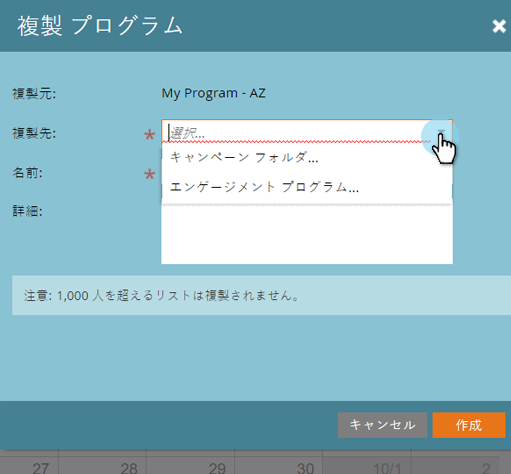
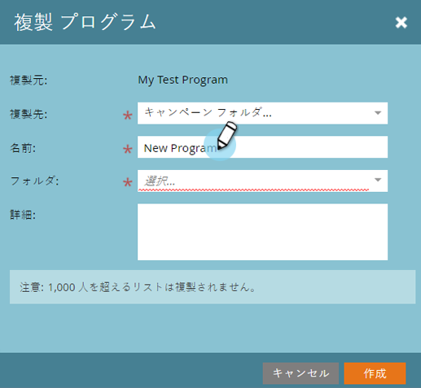
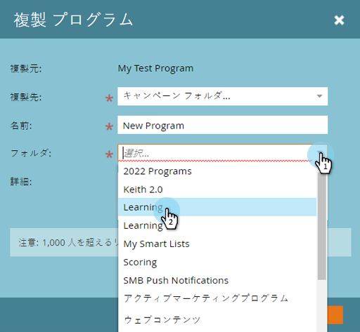
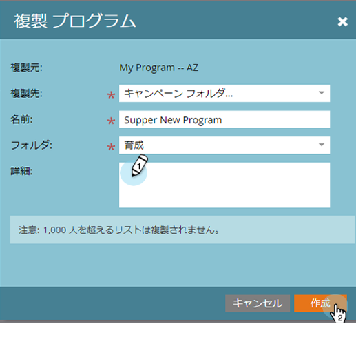

# プログラムのクローン{#clone-a-program}

手動で再構築する代わりに、プログラム全体とそのすべてのアセットをすばやく簡単にコピーすることができます。 これが方法です。

1. コピーするプログラムを探して選択し、**プログラム操作**&#x200B;の下の&#x200B;**コピー**&#x200B;をクリックします。

   

1. プログラムのコピー先を選択します。

   >[!NOTE]
   >
   >プログラムは、[キャンペーン](../../../../product-docs/core-marketo-concepts/miscellaneous/create-new-campaign-folder.md) [フォルダー](../../../../product-docs/core-marketo-concepts/miscellaneous/create-new-campaign-folder.md)または[ワークスペース](../../../../product-docs/administration/workspaces-and-person-partitions/create-a-new-workspace.md)に複製できます。 基になるすべての依存アセット(電子メール、スニペット、ランディングページテンプレートなど)を をコピーする前にコピー先のワークスペースに置き換えます。

   

   >[!NOTE]
   >
   >**説明**
   >
   >
   >上のスクリーンショットに注記が表示されていますか？ つまり、1つのリストに1000人以上の人々がいるプログラムをコピーした場合、リスト自体はコピーされますが、空になります。 999人以下の人を含むリストを使用してプログラムのクローンを作成すると、そのリストとそのすべてのメンバーが、コピーされたプログラムに表示されます。

   名前を入力します。

   

   プログラムのコピー先のフォルダを選択します。
   

1. オプション追加で説明を入力し、「**作成**」をクリックします。 新しいプログラムを作成するのに、そのアセットがすべて準備できたのは、なんて素早かったでしょう。

   

   >[!TIP]
   >
   >この方法を[トークン](http://docs.marketo.com/display/docs/using+tokens)と共に使用して、新しいプログラムの作成をスナップにします。

   >[!CAUTION]
   >
   >期間のコストは繰り返されないので、元のプログラムに期間のコストが設定されている場合は、クローンを作成したフォルダにその期間を必ず追加してください。

