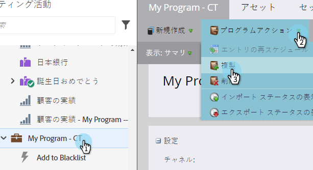
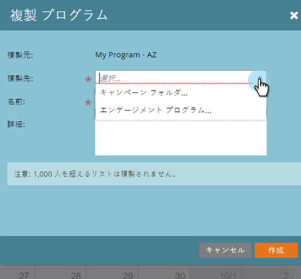
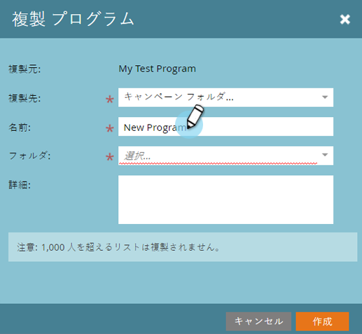
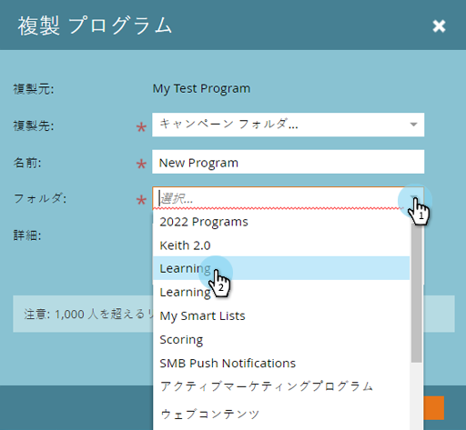
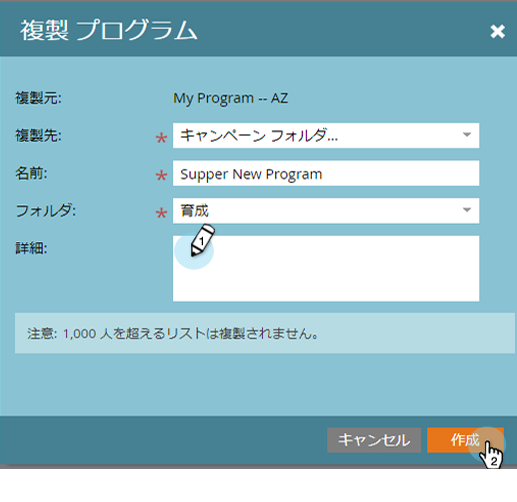

# プログラムの複製 {#clone-a-program}

手作業ですべてを再構築する代わりに、プログラム全体とそのすべてのアセットを複製します。

1. 複製するプログラムを見つけて選択します。 **[!UICONTROL プログラムアクション]**&#x200B;ドロップダウンで、「**[!UICONTROL 複製]**」をクリックします。

   

1. プログラムの複製先を選択します。

   >[!NOTE]
   >
   >プログラムは[キャンペーン](/help/marketo/product-docs/core-marketo-concepts/miscellaneous/create-new-campaign-folder.md) [フォルダー](/help/marketo/product-docs/core-marketo-concepts/miscellaneous/create-new-campaign-folder.md)または[ワークスペース](/help/marketo/product-docs/administration/workspaces-and-person-partitions/create-a-new-workspace.md)に複製できます。 基礎となるすべての依存アセット（メール、スニペット、ランディングページテンプレートなど）を確認します 複製する前に宛先ワークスペースと共有されます。

   

   >[!NOTE]
   >
   >上のスクリーンショットの[!UICONTROL メモ]を参照してください。 つまり、リスト内の 1000 人以上のユーザーを含むプログラムを複製すると、リスト自体は複製されますが、空になります。 999 人以下のリストを含むプログラムを複製すると、そのリストはそのメンバーと共に複製されたプログラムに表示されます。

1. **[!UICONTROL 名前]**&#x200B;を入力します。

   

1. 保存先フォルダーを選択します。

   

1. オプションで説明を追加し、「**[!UICONTROL 作成]**」をクリックします。

   

   >[!TIP]
   >
   >この手法をトークンと組み合わせて使用することで、新しいプログラムの作成を迅速におこなうことができます。

   >[!CAUTION]
   >
   >期間コストは転送されないので、クローンされたプログラムがオリジナルに設定されている場合は、必ずクローンされたプログラムに追加してください。
