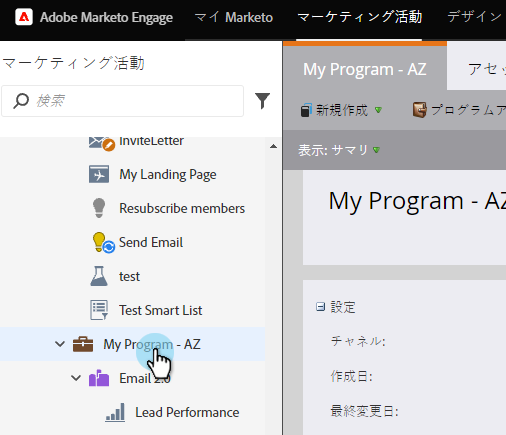
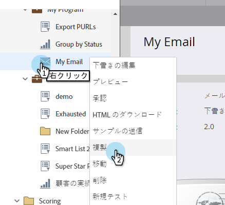
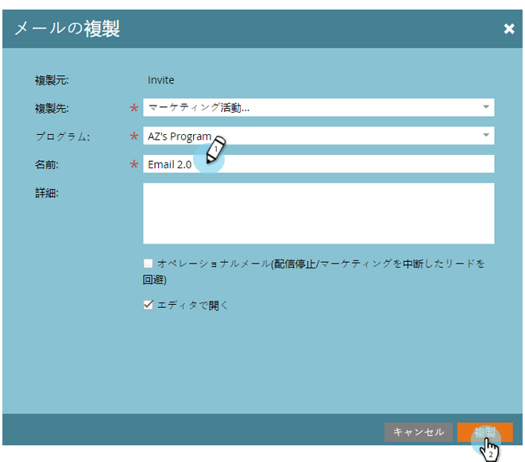
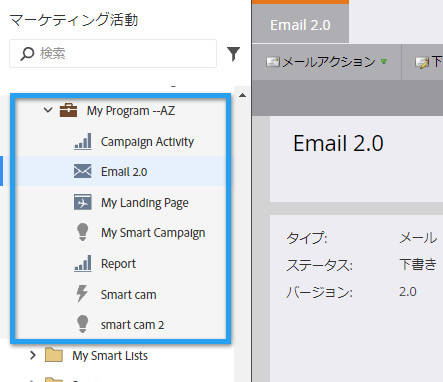

# プログラムでのアセットの複製 {#clone-an-asset-in-a-program}

プログラムを複製すると、_すべて_&#x200B;複製されます。1 つのアセットだけ複製したい場合もあります。手順は以下のとおりです。

>[!NOTE]
>
>[ランディングページのテストグループを複製](/help/marketo/product-docs/demand-generation/landing-pages/landing-page-actions/cloning-a-landing-page-test-group.md)するには、追加の手順を実行する必要があります。

## ローカルアセットを複製する {#clone-a-local-asset}

1. 「**マーケティング****活動**」に移動します。

   

1. プログラムを選択します。

   

1. 複製するローカルアセットを右クリックします。「**複製**」をクリックします。

   

1. アセットの種類ごとに異なるダイアログボックスが表示されます。情報を入力し、「**複製**」をクリックします。

   

   >[!TIP]
   >
   >別のプログラムにアセットを複製することもできます。「**プログラム**」ドロップダウンを使用して選択します。

1. これで完了です。新しく複製されたアセットが表示されます。

   

   >[!NOTE]
   >
   >[プログラムの複製](/help/marketo/product-docs/core-marketo-concepts/programs/working-with-programs/clone-a-program.md)
