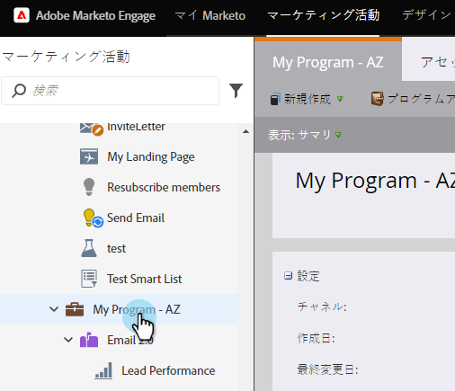
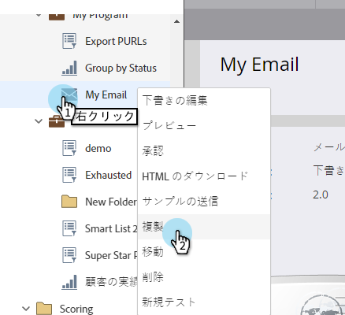
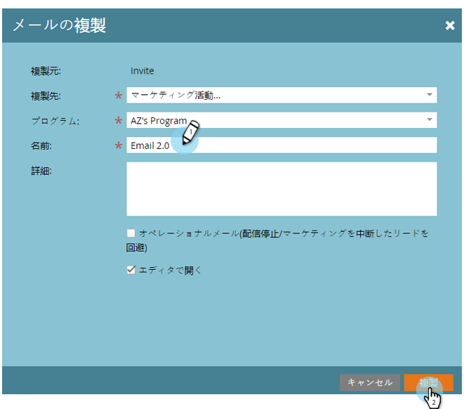
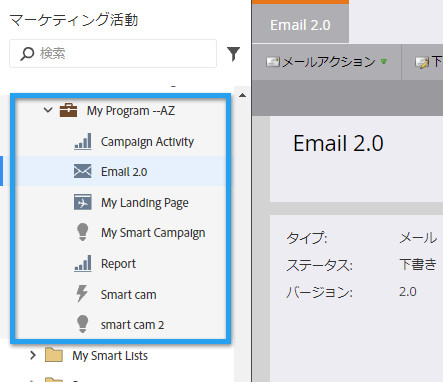

# プログラムでのアセットの複製 {#clone-an-asset-in-a-program}

プログラムを複製すると、_すべて_&#x200B;複製されます。 場合によっては、アセットを1つ複製するだけです。 手順は以下のとおりです。

>[!NOTE]
>
>[ランディングページのテストグループを複製](/help/marketo/product-docs/demand-generation/landing-pages/landing-page-actions/cloning-a-landing-page-test-group.md){target="_blank"}するには、追加の手順を実行する必要があります。

## ローカルアセットを複製する {#clone-a-local-asset}

1. **[!UICONTROL マーケティングアクティビティ]**&#x200B;に移動します。

   

1. プログラムを選択します。

   

1. 複製するローカルアセットを右クリックします。 「**[!UICONTROL 複製]**」をクリックします。

   

1. アセットの種類ごとに異なるダイアログボックスが表示されます。 情報を入力し、「**[!UICONTROL 複製]**」をクリックします。

   

   >[!TIP]
   >
   >別のプログラムにアセットを複製することもできます。 「**[!UICONTROL プログラム]**」ドロップダウンを使用して選択します。

1. 新しい複製されたアセットが表示されます。

   

   >[!NOTE]
   >
   >[プログラムの複製](/help/marketo/product-docs/core-marketo-concepts/programs/working-with-programs/clone-a-program.md){target="_blank"}
