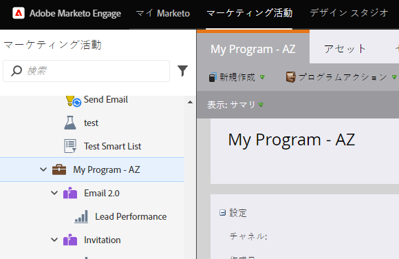
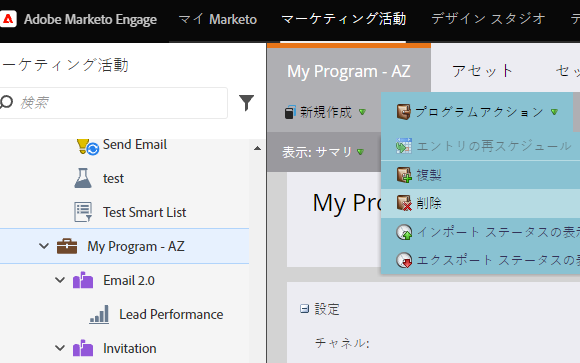
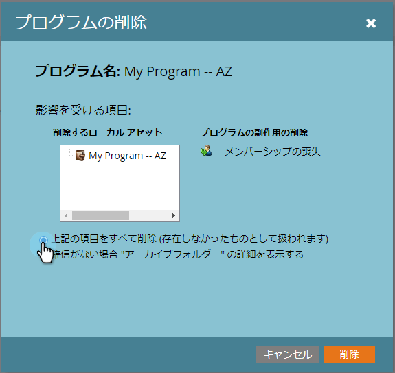
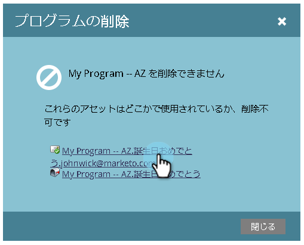
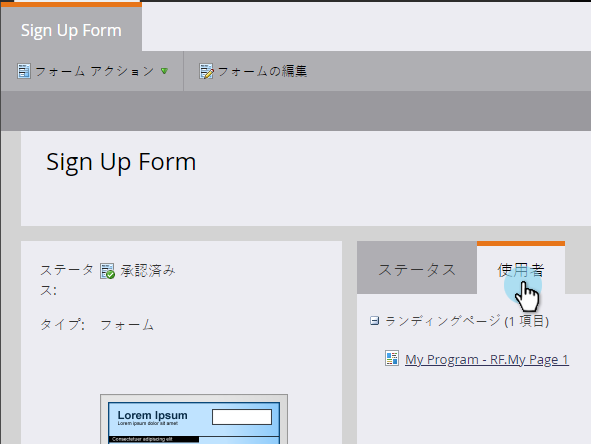

# プログラムの削除{#delete-a-program}

プログラムはアーカイブできますが、完全に削除したい場合もあります。 これが方法です。

1. 削除するプログラムを選択します。

1. 「**プログラムアクション**」をクリックします。 「**削除**」をクリックします。

   

1. 「すべて削除」オプションを選択します。 プログラムの削除の副作用を確認し、「**削除**」をクリックして確認します。

>[!TIP]
>
>**アーカイブ** プログラムはプログラムデータを歪曲しますが、プログラムを邪魔しません。アーカイブの詳細を表示するには、そのオプションを選択し、「**次へ**」をクリックします。

完了。 プログラムは存在しなかったようです

## プログラムを削除できないのはなぜですか。{#why-cant-i-delete-my-program}

プログラムには、システム内の別の場所で使用されるアセットを含めることができます。これにより、プログラムを削除できなくなります。

この問題を修正するには、ドリルダウンして承認/削除を取り消す必要がある場合があります。 次の手順に従います。

1. リンクをクリックして、アセットに移動します。

   

1. 「**使用者**」をクリックして、アセットが使用されている場所を確認します。

   

   アセットが使用されている場所を特定したら、アセットに移動して、承認/削除を取り消します。 次に、プログラムの削除を再試行します。
