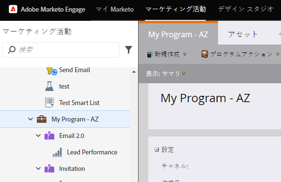
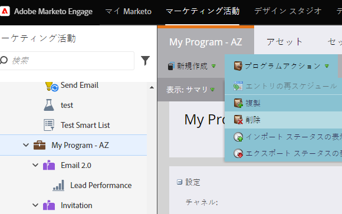
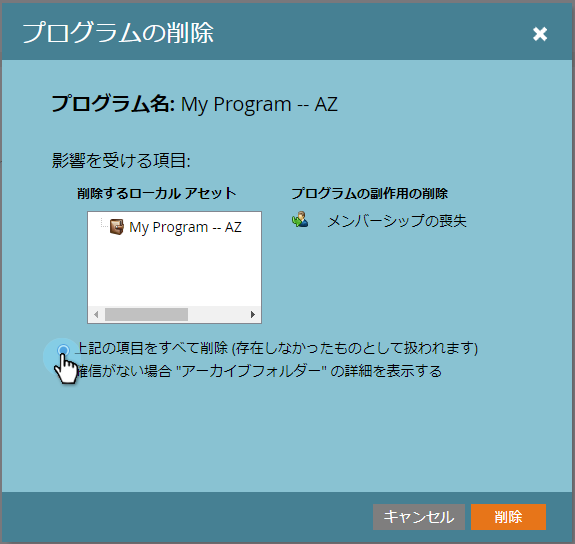
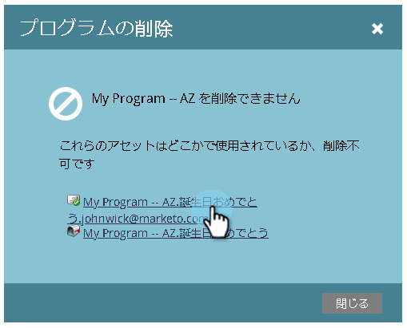
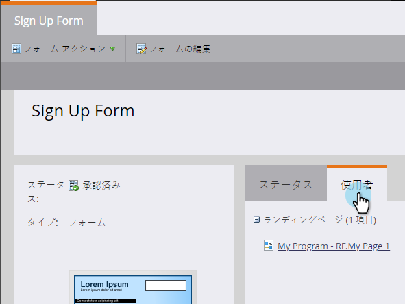

# プログラムの削除 {#delete-a-program}

プログラムはアーカイブできますが、ときには完全に削除したい場合もあります。 ここでは、その方法を説明します。

1. 削除するプログラムをクリックします。

1. 「**[!UICONTROL プログラムアクション]**」ドロップダウンをクリックし、**[!UICONTROL 削除]**&#x200B;を選択します。

   

1. 「すべてを削除…」を選択します ラジオボタン： プログラムの削除の影響を確認し、**[!UICONTROL 削除]**&#x200B;をクリックして確認します。

>[!TIP]
>
>プログラムのアーカイブは、プログラムデータを保持しますが、プログラムを邪魔にはしません。 詳細は、該当のオプションをクリックしてから「**[!UICONTROL 次へ]**」をクリックしてください。

完了です。 プログラムは決して存在しなかったようなものです。

## プログラムを削除できないのはなぜですか？ {#why-cant-i-delete-my-program}

システムの別の場所で使われているアセットが、プログラムに含まれている可能性があります。

この問題を解決するには、ドリルダウンして承認/削除を取り消す必要がある場合があります。 以下の手順を実行してください。

1. リンクをクリックしてアセットに移動します。

   

1. 「**[!UICONTROL 使用先]**」をクリックし、アセットがどこで使用されているかを確認します。

   

   アセットがどこで使用されているかを確認できたら、その場所に移動して承認解除／削除します。 完了したら、プログラムの削除を再試行してください。
