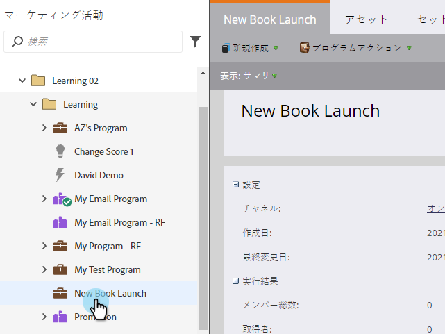
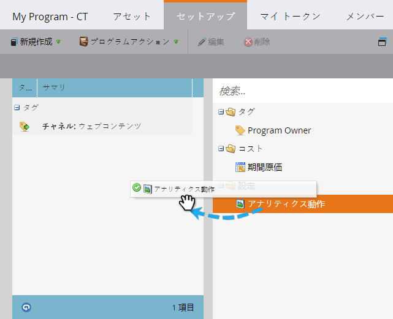
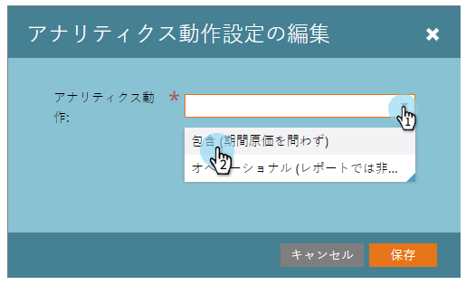
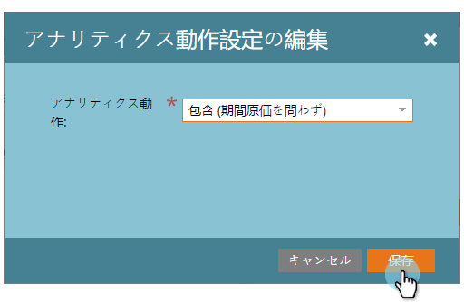

# Analytics動作設定の編集{#edit-analytics-behavior-settings}

[Analyticsの動作は、チャネル](../../../../product-docs/reporting/revenue-cycle-analytics/program-analytics/make-a-program-without-a-period-cost-available-in-revenue-explorer-and-analyzers.md)の管理者レベルで設定できますが、プログラムレベルで編集することもできます。 これが方法です。

1. 「マーケティングアクティビティ」に移動します。

   

1. プログラムを探して選択します。

   

1. 「設定」タブで、「Analyticsの動作」をキャンバスにドラッグします。

   

1. 目的のAnalyticsの動作を選択します。

   

>[!NOTE]
>
>**定義**
>
>* 包括的 — このオプションを選択すると、期間コストを含めているかどうかに関係なく、売上高エクスプローラおよびアナライザでプログラムをレポートできます。
>* 操作可能 — このオプションを選択すると、売上高エクスプローラーまたはアナライザーにプログラムが表示されません。

>

>[!NOTE]
>
>デフォルトの動作（この設定が適用されない場合）は、プログラムがAnalytics ONLYに含まれるのは、少なくとも1つの期間のコストがある場合で、0ドルが割り当てられているものも含まれます。

1. 「保存」をクリックします。

   

うまくいった！ これで、プログラムレベルで解析の動作を上書きする方法がわかりました。

>[!NOTE]
>
>**Reminder**
>
>変更は次の日に有効になり、プログラムが使用可能になるか、売上高のエクスプローラーやアナライザーから取り出されます。

