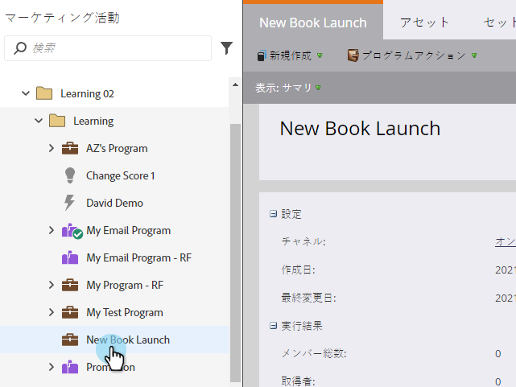
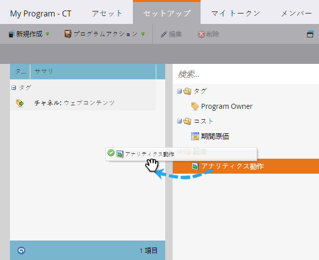
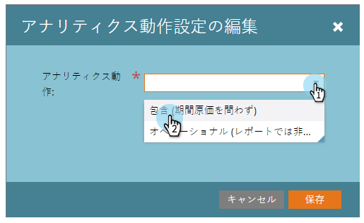
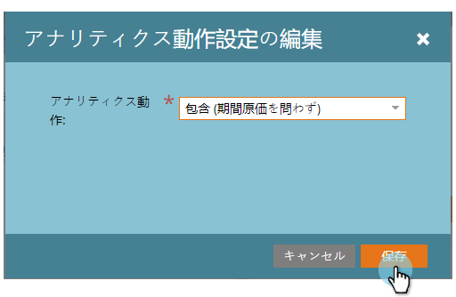

# アナリティクス動作設定の編集 {#edit-analytics-behavior-settings}

プログラムレベルで分析行動を編集する方法について説明します。

1. **[!UICONTROL マーケティングアクティビティ]**&#x200B;に移動します。

   

1. プログラムを選択します。

   

1. 「**[!UICONTROL 設定]**」タブで、[!UICONTROL Analytics ビヘイビアー]をキャンバスにドラッグします。

   

1. 目的の分析動作を選択します。

   

>[!NOTE]
>
>**定義**
>
>**[!UICONTROL 包含]** - このオプションを使用すると、期間原価が含まれているかどうかに関係なく、収益エクスプローラーおよびアナライザーでプログラムをレポートに表示できます。
>
>**[!UICONTROL オペレーショナル]** - このオプションを選択すると、プログラムが収益エクスプローラーまたはアナライザーに表示されなくなります。

>[!NOTE]
>
>デフォルトの動作（この設定が適用されていない場合）は、1 つ以上の期間原価（0 ドルが割り当てられている期間も含む）がある場合にのみアナリティクスに含まれます。

1. 「**[!UICONTROL 保存]**」をクリックします。

   

分析ビヘイビアーはプログラムレベルで上書きされました。

>[!NOTE]
>
>変更は翌日に有効になり、プログラムは利用可能になるか、収益エクスプローラーおよびアナライザーから取得されます。
