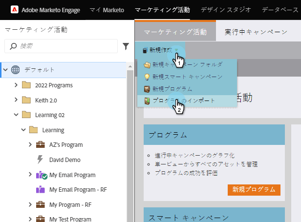
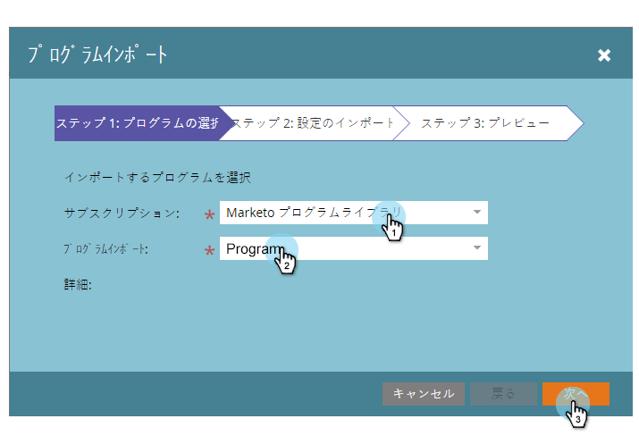
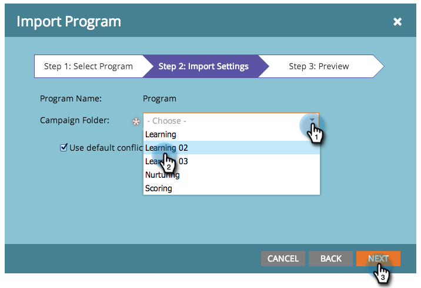

# プログラムのインポート {#import-a-program}

プログラムは、ある Marketo サブスクリプションから別のサブスクリプションにインポートできます。例えば、サンドボックスでプログラムを作成し、ライブサブスクリプションにインポートできます。また、事前定義済みプログラムを Marketo プログラムライブラリからインポートすることもできます。

## プログラムのインポート {#import-a-program-1}

1. に移動します。 **マーケティング活動。**

   

1. クリック **新規** ドロップダウンします。 選択 **プログラムの読み込み**.

   

   >[!NOTE]
   >
   >プログラムのインポートは、「プログラムのインポート」権限が有効になっているロールを持つユーザーのみが使用できます。 詳細情報： [ユーザーの役割と権限の管理](/help/marketo/product-docs/administration/users-and-roles/managing-user-roles-and-permissions.md).
   >
   >Sandbox アカウントを Live サブスクリプションに接続するには、にお問い合わせください。 [Marketoサポート](https://nation.marketo.com/t5/Support/ct-p/Support).

1. Marketoを選択 **購読** および読み込むプログラム。 「**次へ**」をクリックします。

   

1. を指定します。 **キャンペーンフォルダ** 読み込まれたプログラム用。 クリック **次へ**

   

   >[!NOTE]
   >
   >確認 **デフォルトの競合を使用** ルールが選択されている。 同じ名前のアセットを持つインスタンスにプログラムを読み込む場合は、競合ルールが必要です。

1. 詳細をプレビューし、 **インポート** プログラム。

   

   プログラムのインポートの進行状況がダイアログに表示されます。

   

インポートが完了すると、確認の電子メールが送信されます。

>[!NOTE]
>
>インポートしたバッチキャンペーンを再スケジュールし、トリガーキャンペーンを有効にする必要があります。 インポートされたプログラム内のキャンペーンスケジュールおよびトリガーキャンペーンが自動的に無効化されます。

## Marketoプログラムライブラリでの事前定義済みプログラムの識別 {#identify-pre-built-programs-in-the-marketo-program-library}

Marketo Program Library には、サブスクリプションに読み込むことができる、事前に作成されたテスト済みプログラムが含まれています。 利用可能なプログラムは次のとおりです。

1. **基本点滴育成。** 一連の E メールを待機手順で分けて送信します。
1. **データ管理.** スマートキャンペーンを使用してデータの整合性を維持します。
1. **ランディングページ付きメール。** 「このホワイトペーパーをダウンロード」など、オファーを含む最初の E メールを送信します。 確認またはリマインダーの電子メールが添付されたフォローアップです。 フォームを含むランディングページを含めます。
1. **進行状況ステータスのメール。** クリックする人の追跡可能なリンクを含むメールブラストを送信します。 各人の進行状況のステータス（送信済み、開封済み、クリックなど）を更新します。
1. **注目のアクション.** セールスチームが顧客をループに保つための注目のアクションを作成します。
1. **自動応答を使用したランディングページ。** ダウンロード可能なコンテンツを使用して、新しい担当者を取得し、それらを育成します。 ランディングページとフォームが含まれます。
1. **ライフサイクル 2.** スコアリングを使用して、新規顧客をマーケティング認定に移動します。
1. **モバイル電子メールテンプレート。** iPhoneと Android に対してテストされたレスポンシブ E メールテンプレート。 Android、MS Outlook、Exchange、および Gmail や Yahoo！などのサードパーティアプリの特定のバージョン。 メールモバイルアプリは、レスポンシブテンプレートに必要な CSS をサポートしていません。 E メールを送信する前に、テストを実施することをお勧めします。
1. **プログラムのインポート懸賞。** プログラムライブラリを試す方々に対して懸賞を行います！ メールとランディングページを承認し、スマートキャンペーンを有効化します。 承認済みのランディングページを表示し、フォームに入力すると、入力が完了します。
1. **販売可能なキャンペーン。** 営業担当が CRM のダッシュボードからMarketoのスマートキャンペーンを実行できるようにします。
1. **スコア — Spark エディション。** 単一のスコアフィールドでキャプチャされた人口統計学的および行動スコア。 20 を超えるスコアリング関連キャンペーンが含まれます。
1. **スコア — Standard および Select の各エディション。** 別々のスコアフィールドでキャプチャされた人口統計および行動スコア。 20 を超えるスコアリング関連キャンペーンが含まれます。
1. **新規担当者を CRM に同期します。** CRM システムに新しい担当者を同期するキャンペーン。 販売準備ができていないと認識される人物ステータスを割り当てます。
1. **イベントアダプタを使用したオンラインセミナ。** 招待メールやリマインダーメール、さらにプログラム内で人々を動かすためのフォームやキャンペーンを含むランディングページが一式にまとめられています。 このプログラムは、登録、出席などに関する更新を受け取ります。 WebEx などのオンラインイベントプロバイダーから
1. **イベントアダプタのないオンラインセミナ。** 上記と同じ。ただし、登録や出席等の記録を手動で行う場合
1. **Sirius 決定評価プログラム**. このプログラムは、暗黙的で明示的なスコアルールやマトリックス化された個人割り当てなど、標準的な Sirius Decisions Scoring Model をサポートするように構築されています。

>[!CAUTION]
>
>Scoring - Standard &amp; Select エディションプログラムを読み込む前に、2 つのカスタムフィールド（「人口統計スコア」と「行動スコア」）を作成する必要があります。

## プログラムの読み込み中の外部アセットへの影響 {#impact-on-external-assets-during-program-imports}

プログラムは、電子メールテンプレート、ランディングページテンプレート、画像、フォーム、トークン、プログラムタグなどの外部アセットを使用します。 ランディングページテンプレートとプログラムタグの処理方法を設定でき、残りはMarketoが自動的に管理します。

**メール/ランディングページテンプレート：** 電子メール/ランディングページテンプレートがデザインスタジオに読み込まれます。 同じ名前のテンプレートが存在する場合、競合ルールを使用して動作を設定できます。 同じ名前の数字が存在する場合は、デフォルトのルールを使用して、テンプレートに数字が追加されます。 例えば、「標準テンプレート」という名前のテンプレートが既に存在する場合、新しいテンプレートの名前は「標準テンプレート 1」になります。

**画像：** ランディングページで使用される画像は、同じ名前の画像が存在しない限り、デザインスタジオに読み込まれます。

**トークン：** プログラム外に存在するトークンは、インポートプロセス中にローカルトークンに変換されます。

>[!CAUTION]
>
>プログラムのインポートでは、イメージタイプマイトークンはサポートされていません。 イメージタイプのプログラムがインポートされる場合、 **いいえ** トークンが通過します。

**プログラムタグ：** 競合ルールを使用して、宛先アカウントに存在しないプログラムタグの処理方法を制御できます。 デフォルトのルールを使用すると、プログラムタグが作成されます。または、タグを無視するように選択することもできます。

**Forms:** 同じ名前のフォームが存在しない場合、外部フォームはデザインスタジオに自動的に読み込まれます。

>[!CAUTION]
>
>プログラムをインポートする際、 [動的コンテンツ](/help/marketo/product-docs/personalization/segmentation-and-snippets/segmentation/understanding-dynamic-content.md) がスキップされます。
