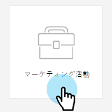
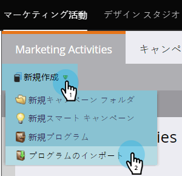
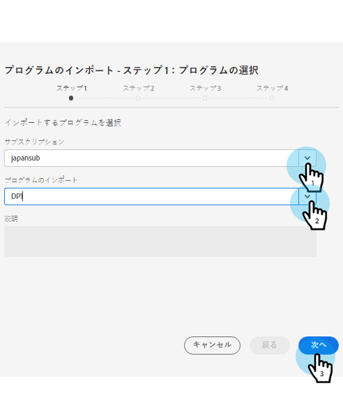
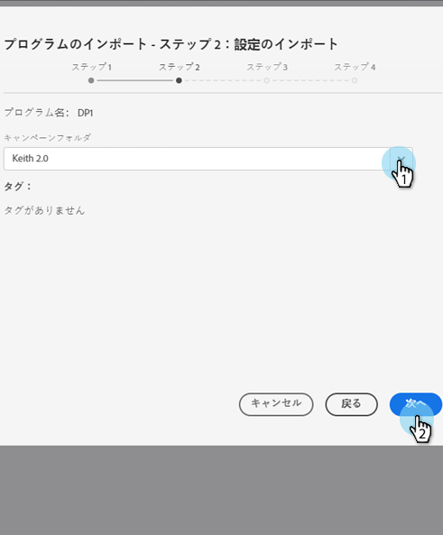
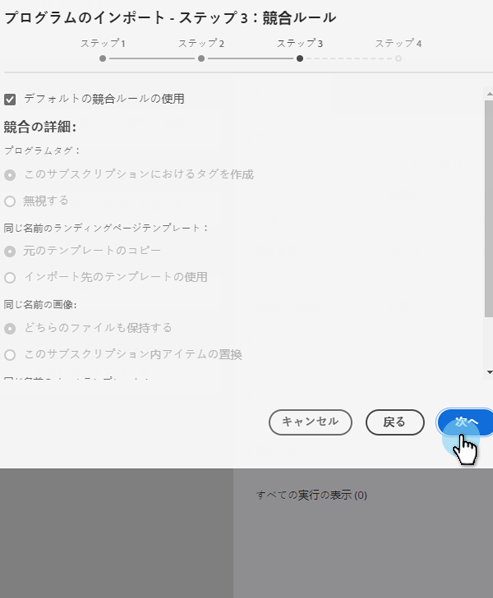
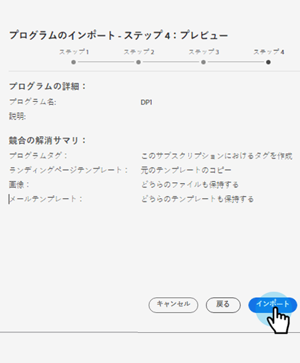

# プログラムのインポート {#import-a-program}

プログラムは、ある Marketo サブスクリプションから別のサブスクリプションにインポートできます。例えば、サンドボックスでプログラムを作成し、ライブサブスクリプションにインポートできます。また、事前定義済みプログラムを Marketo プログラムライブラリからインポートすることもできます。

## プログラムのインポート {#import-a-program-1}

1. 「**マーケティング活動**」に移動します。

   

1. 「**新規**」ドロップダウンをクリックします。「**プログラムをインポート**」を選択します。

   

   >[!NOTE]
   >
   >プログラムのインポートは、「プログラムのインポート」権限が有効になっている役割を持つユーザーのみが使用できます。詳しくは、[ユーザーの役割と権限の管理](/help/marketo/product-docs/administration/users-and-roles/managing-user-roles-and-permissions.md)を参照してください。
   >
   >サンドボックスアカウントをライブサブスクリプションに接続するには、[Marketo サポート](https://nation.marketo.com/t5/Support/ct-p/Support)にご連絡ください。

1. Marketo **サブスクリプション**&#x200B;を選択してインポートするプログラムを選択します。「**次へ**」をクリックします。

   

1. インポートされたプログラム用の&#x200B;**キャンペーンフォルダー**&#x200B;を指定します。「**次へ**」をクリックします。

   

   >[!NOTE]
   >
   >「**デフォルトの競合を使用**」ルールが選択されている事を確認します。同じ名前のアセットを持つインスタンスにプログラムを読み込む場合は、競合ルールが必要です。

1. 目的の「競合の詳細」を選択し、 **次へ**.

   

1. 詳細をプレビューし、プログラムを「**インポート**」します。

   

インポートが完了すると、確認のメールが送信されます。

>[!NOTE]
>
>インポートしたバッチキャンペーンを再スケジュールし、トリガーキャンペーンを有効にする必要があります。インポートされたプログラム内のキャンペーンスケジュールおよびトリガーキャンペーンが自動的に無効化されます。

## Marketo プログラムライブラリでの事前定義済みプログラムの識別 {#identify-pre-built-programs-in-the-marketo-program-library}

Marketo プログラムライブラリには、サブスクリプションにインポートすることができる、事前定義済みのテスト済みプログラムが含まれています。利用可能なプログラムは次のとおりです。

1. **基本的なドリップナーチャリング。**&#x200B;一連のメールを待機ステップで分けて送信します。
1. **データ管理。**&#x200B;スマートキャンペーンを使用してデータの整合性を維持します。
1. **ランディングページ付きメール。**「このホワイトペーパーをダウンロード」など、オファーを含む最初のメールを送信します。確認またはリマインダーのメールが添付されたフォローアップです。フォームを含むランディングページも含まれます。
1. **進行状況ステータス付きのメール。**&#x200B;クリックする人の追跡可能なリンクを含む一斉配信メールを送信します。各人の進行状況のステータス（送信済み、開封済み、クリックなど）を更新します。
1. **注目のアクション。**&#x200B;セールスチームが顧客に絶えず最新情報を届けるための注目のアクションを作成します。
1. **自動応答を使用したランディングページ。**&#x200B;ダウンロード可能なコンテンツを使用して、新しい人物を取得して育成します。ランディングページとフォームも含まれます。
1. **ライフサイクル 2。**&#x200B;スコアリングを使用して、人物をマーケティング認定に移動します。
1. **モバイル電子メールテンプレート。** iPhone と Android に対してテスト済みのレスポンシブメールテンプレート。Android、MS Outlook、Exchange および Gmail や Yahoo！などのサードパーティアプリの特定のバージョン。メールモバイルアプリは、レスポンシブテンプレートに必要な CSS をサポートしていません。メールを送信する前に、テストを実施することをお勧めします。
1. **プログラムのインポート懸賞。**&#x200B;プログラムライブラリを試す人々を対象にした懸賞プログラムです。メールとランディングページを承認し、スマートキャンペーンを有効化します。承認済みのランディングページを表示し、フォームに入力すると、入力が完了します。
1. **セールスが利用可能なキャンペーン。**&#x200B;セールス担当が CRM のダッシュボードから Marketo のスマートキャンペーンを実行できるようにします。
1. **スコア - Spark エディション。**&#x200B;単一のスコアフィールドでキャプチャされたデモグラフィックおよび行動スコア。20 を超えるスコアリング関連キャンペーンが含まれます。
1. **スコア - Standard および Select エディション。**&#x200B;別々のスコアフィールドでキャプチャされたデモグラフィックおよび行動スコア。20 を超えるスコアリング関連キャンペーンが含まれます。
1. **新規人物を CRM に同期。** CRM システムに新しい人物を同期するキャンペーン。セールス準備完了とされていない人物ステータスを割り当てます。
1. **イベントアダプターを使用したウェビナー。**&#x200B;招待メールやリマインダーメール、さらにプログラム内で人々を動かすためのフォームやキャンペーンを含むランディングページが一式にまとめられています。このプログラムは、登録、出席などに関する更新情報を WebEx などのオンラインイベントプロバイダーから受け取ります。
1. **イベントアダプターを使用しないウェビナー。**&#x200B;上記と同じ。ただし、登録や出席等の記録を手動で行う場合です。
1. **Sirius 決定スコアリングプログラム**。このプログラムは、暗黙的および明示的なスコアルールやマトリックス化された個人割り当てなど、標準的な Sirius 決定スコアリングモデルをサポートするように構築されています。

>[!CAUTION]
>
>スコア - Standard および Select エディションプログラムをインポートする前に、2 つのカスタムフィールド（「デモグラフィックスコア」と「行動スコア」）を作成する必要があります。

## プログラムインポート中の外部アセットへの影響 {#impact-on-external-assets-during-program-imports}

プログラムは、メールテンプレート、ランディングページテンプレート、画像、フォーム、トークン、プログラムタグなどの外部アセットを使用します。ランディングページテンプレートとプログラムタグの処理方法を設定でき、残りは Marketo が自動的に管理します。

**メール／ランディングページテンプレート：**&#x200B;メール／ランディングページテンプレートがデザインスタジオに読み込まれます。同じ名前のテンプレートが存在する場合、競合ルールを使用して動作を設定できます。同じ名前が存在する場合は、デフォルトのルールを使用して、テンプレートに数字が追加されます。例えば、「標準テンプレート」という名前のテンプレートが既に存在する場合、新しいテンプレートの名前は「標準テンプレート — 1」になります。

**ランディングページ/Forms:** 同じ名前のフォームまたはランディングページが Design Studio に存在する場合、それらは引き続き読み込まれますが、名前に数字が追加されます ( 例：ランディングページ — 1)。

**画像：**&#x200B;ランディングページで使用される画像は、同じ名前の画像が存在しない限り、デザインスタジオにインポートされます。

**トークン：**&#x200B;プログラム外に存在するトークンは、インポートプロセス中にローカルトークンに変換されます。

>[!CAUTION]
>
>プログラムのインポートでは、イメージタイプマイトークンはサポートされていません。マイトークンのイメージタイプを含むプログラムがインポートされる場合、すべてのトークンが&#x200B;**インポートされません**。

**プログラムタグ：**&#x200B;競合ルールを使用して、宛先アカウントに存在しないプログラムタグの処理方法を制御できます。デフォルトのルールを使用すると、プログラムタグが作成されます。または、タグを無視するように選択することもできます。

>[!CAUTION]
>
>プログラムをインポートする際、[動的コンテンツ](/help/marketo/product-docs/personalization/segmentation-and-snippets/segmentation/understanding-dynamic-content.md)を含むメール／ランディングページはスキップされます。
