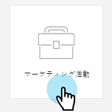
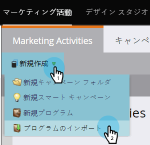
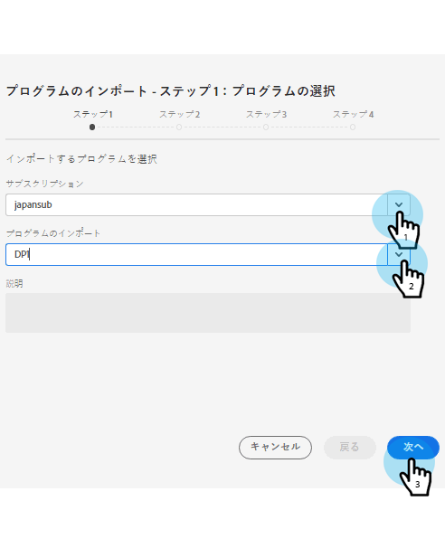
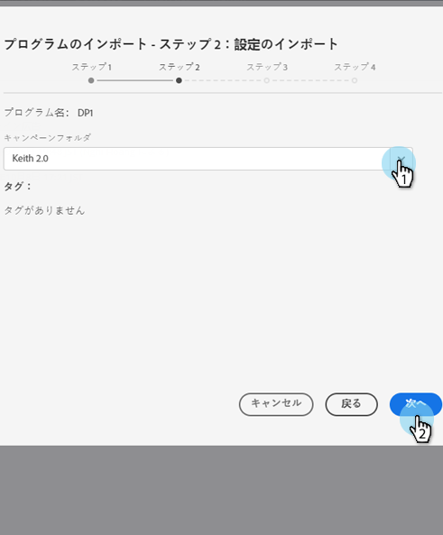
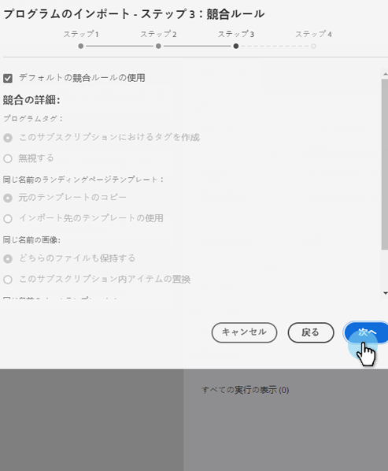
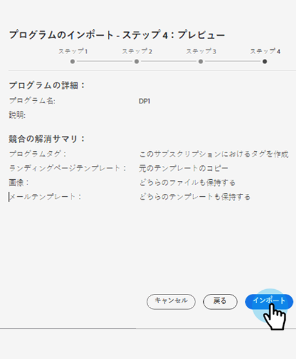

# プログラムのインポート {#import-a-program}

プログラムは、あるMarketo Engage サブスクリプションから別のサブスクリプションに読み込むことができます。 例えば、サンドボックスでプログラムを作成し、ライブサブスクリプションにインポートできます。 また、[Marketo プログラムライブラリ ](/help/marketo/product-docs/core-marketo-concepts/programs/program-library/program-import-library-overview.md){target="_blank"}から事前定義済みのプログラムを読み込むこともできます。

>[!CAUTION]
>
>
>* プログラムを読み込むと、スニペットまたは[動的コンテンツ ](/help/marketo/product-docs/personalization/segmentation-and-snippets/segmentation/understanding-dynamic-content.md){target="_blank"}を含むメール/ランディングページはスキップされます。
>
>* 「カスタムオブジェクトが更新されました」トリガーを含むスマートリストを持つプログラムは、読み込みに失敗します。 以下の手順に従う前に、このトリガーをすべてのスマートリストから削除してください。

## プログラムのインポート {#importing-a-program}

1. **[!UICONTROL マーケティングアクティビティ]**&#x200B;に移動します。

   

1. 「**[!UICONTROL 新規]**」ドロップダウンをクリックし、**[!UICONTROL プログラムの読み込み]**&#x200B;を選択します。

   

   >[!NOTE]
   >
   >* プログラムのインポートは、「プログラムのインポート」権限が有効になっているロールを持つユーザのみが使用できます。 詳しくは、[ユーザのロールと権限の管理](/help/marketo/product-docs/administration/users-and-roles/managing-user-roles-and-permissions.md){target="_blank"}を参照してください。
   >
   >* サンドボックスアカウントをライブサブスクリプションに接続するには、[Marketo サポート](https://nation.marketo.com/t5/Support/ct-p/Support){target="_blank"}にご連絡ください。

1. Marketo **[!UICONTROL サブスクリプション]**&#x200B;を選択してインポートするプログラムを選択します。 「**[!UICONTROL 次へ]**」をクリックします。

   

1. インポートされたプログラム用の&#x200B;**[!UICONTROL キャンペーンフォルダー]**&#x200B;を指定します。 「**[!UICONTROL 次へ]**」をクリックします。

   

   >[!NOTE]
   >
   >「**[!UICONTROL デフォルトの競合を使用]**」ルールが選択されている事を確認します。 同じ名前のアセットを持つインスタンスにプログラムを読み込む場合は、競合ルールが必要です。

1. 目的の競合の詳細を選択し、「**[!UICONTROL 次へ]**」をクリックします。

   

   >[!NOTE]
   >
   >互換性のあるサービスプロバイダーが複数ある宛先インスタンスに、カスタムフローステップまたはフローステップから派生したスマートリストルールを使用するプログラムをインポートすると、宛先インスタンスの正しいサービスプロバイダーに割り当てるよう求められます。

1. 詳細をプレビューし、プログラムを「**[!UICONTROL インポート]**」します。

   

インポートが完了すると、メール確認が送信されます。

>[!NOTE]
>
>インポートしたバッチキャンペーンを再スケジュールし、トリガーキャンペーンを有効にする必要があります。 インポートされたプログラム内のキャンペーンスケジュールおよびトリガーキャンペーンが自動的に無効化されます。

## プログラムインポート中の外部アセットへの影響 {#impact-on-external-assets-during-program-imports}

プログラムは、メールテンプレート、ランディングページテンプレート、画像、フォーム、トークン、プログラムタグなどの外部アセットを使用します。 ランディングページテンプレートとプログラムタグの処理方法を設定でき、残りはMarketoが自動的に管理します。

**メール／ランディングページテンプレート：**&#x200B;メール／ランディングページテンプレートがデザインスタジオに読み込まれます。 同じ名前のテンプレートが存在する場合、競合ルールを使用して動作を設定できます。 同じ名前が存在する場合は、デフォルトのルールを使用して、テンプレートに数字が追加されます。 例えば、「標準テンプレート」という名前のテンプレートが既に存在する場合、新しいテンプレートの名前は「標準テンプレート - 1」になります。

**ランディングページ/Forms:** Design Studioに同じ名前のフォームまたはランディングページが存在する場合、それらのフォームは引き続き読み込まれますが、名前に番号が追加されます（例：ランディングページ - 1）。

**画像：**&#x200B;同じ名前の画像が存在しない限り、ランディングページで使用される画像は、デザインスタジオに読み込まれます。

**トークン：**&#x200B;プログラム外に存在するトークンは、インポートプロセス中にローカルトークンに変換されます。

>[!CAUTION]
>
>プログラムのインポートでは、イメージタイプマイトークンはサポートされていません。 マイトークンのイメージタイプを含むプログラムがインポートされる場合、すべてのトークンが&#x200B;_インポートされません_。

**プログラムタグ：**&#x200B;競合ルールを使用して、宛先アカウントに存在しないプログラムタグの処理方法を制御できます。 デフォルトのルールを使用すると、プログラムタグが作成されます。または、タグを無視するように選択することもできます。
