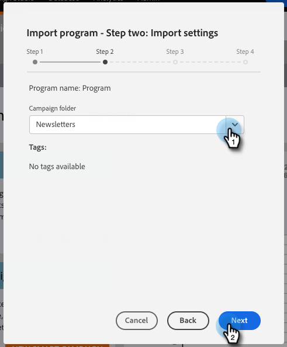
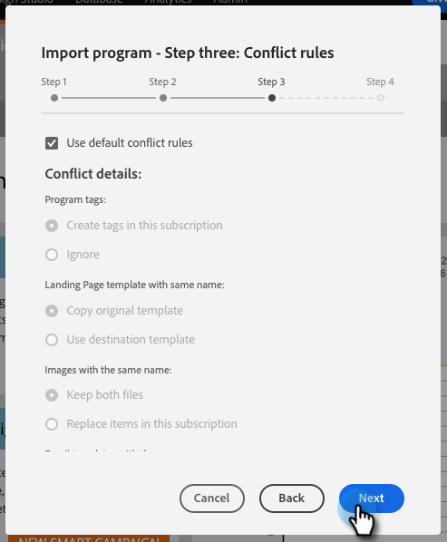

# プログラムのインポート {#import-a-program}

プログラムは、ある Marketo サブスクリプションから別のサブスクリプションにインポートできます。例えば、サンドボックスでプログラムを作成し、ライブサブスクリプションにインポートできます。また、事前定義済みプログラムを Marketo プログラムライブラリからインポートすることもできます。

## プログラムのインポート {#importing-a-program}

1. 「**マーケティングアクティビティ**」に移動します。

   

1. 「**新規**」ドロップダウンをクリックします。「**プログラムをインポート**」を選択します。

   

   >[!NOTE]
   >
   >プログラムのインポートは、「プログラムのインポート」権限が有効になっているロールを持つユーザのみが使用できます。詳しくは、[ユーザのロールと権限の管理](/help/marketo/product-docs/administration/users-and-roles/managing-user-roles-and-permissions.md)を参照してください。
   >
   >サンドボックスアカウントをライブサブスクリプションに接続するには、[Marketo サポート](https://nation.marketo.com/t5/Support/ct-p/Support)にご連絡ください。

1. Marketo **サブスクリプション**&#x200B;を選択してインポートするプログラムを選択します。「**次へ**」をクリックします。

   

1. インポートされたプログラム用の&#x200B;**キャンペーンフォルダー**&#x200B;を指定します。「**次へ**」をクリックします。

   

   >[!NOTE]
   >
   >「**デフォルトの競合を使用**」ルールが選択されている事を確認します。同じ名前のアセットを持つインスタンスにプログラムを読み込む場合は、競合ルールが必要です。

1. 目的の競合の詳細を選択し、「**次へ**」をクリックします。

   

   >[!NOTE]
   >
   >互換性のあるサービスプロバイダーが複数ある宛先インスタンスに、カスタムフローステップまたはフローステップから派生したスマートリストルールを使用するプログラムをインポートすると、宛先インスタンスの正しいサービスプロバイダーに割り当てるよう求められます。

1. 詳細をプレビューし、プログラムを「**インポート**」します。

   

インポートが完了すると、確認のメールが送信されます。

>[!NOTE]
>
>インポートしたバッチキャンペーンを再スケジュールし、トリガーキャンペーンを有効にする必要があります。インポートされたプログラム内のキャンペーンスケジュールおよびトリガーキャンペーンが自動的に無効化されます。

## プログラムインポート中の外部アセットへの影響 {#impact-on-external-assets-during-program-imports}

プログラムは、メールテンプレート、ランディングページテンプレート、画像、フォーム、トークン、プログラムタグなどの外部アセットを使用します。ランディングページテンプレートとプログラムタグの処理方法を設定でき、残りは Marketo が自動的に管理します。

**メール／ランディングページテンプレート：**&#x200B;メール／ランディングページテンプレートがデザインスタジオに読み込まれます。同じ名前のテンプレートが存在する場合、競合ルールを使用して動作を設定できます。同じ名前が存在する場合は、デフォルトのルールを使用して、テンプレートに数字が追加されます。例えば、「標準テンプレート」という名前のテンプレートが既に存在する場合、新しいテンプレートの名前は「標準テンプレート - 1」になります。

**ランディングページ／フォーム：**&#x200B;同じ名前のフォームまたはランディングページがデザインスタジオに存在する場合、それらはインポートされますが、名前に数字が追加されます（例：ランディングページ - 1）。

**画像：**&#x200B;ランディングページで使用される画像は、同じ名前の画像が存在しない限り、デザインスタジオにインポートされます。

**トークン：**&#x200B;プログラム外に存在するトークンは、インポートプロセス中にローカルトークンに変換されます。

>[!CAUTION]
>
>プログラムのインポートでは、イメージタイプマイトークンはサポートされていません。マイトークンのイメージタイプを含むプログラムがインポートされる場合、すべてのトークンが&#x200B;**インポートされません**。

**プログラムタグ：**&#x200B;競合ルールを使用して、宛先アカウントに存在しないプログラムタグの処理方法を制御できます。デフォルトのルールを使用すると、プログラムタグが作成されます。または、タグを無視するように選択することもできます。

>[!CAUTION]
>
>プログラムをインポートする際、[動的コンテンツ](/help/marketo/product-docs/personalization/segmentation-and-snippets/segmentation/understanding-dynamic-content.md)を含むメール／ランディングページはスキップされます。
