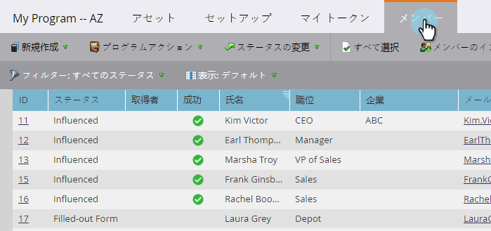
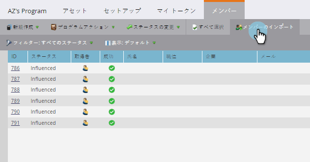
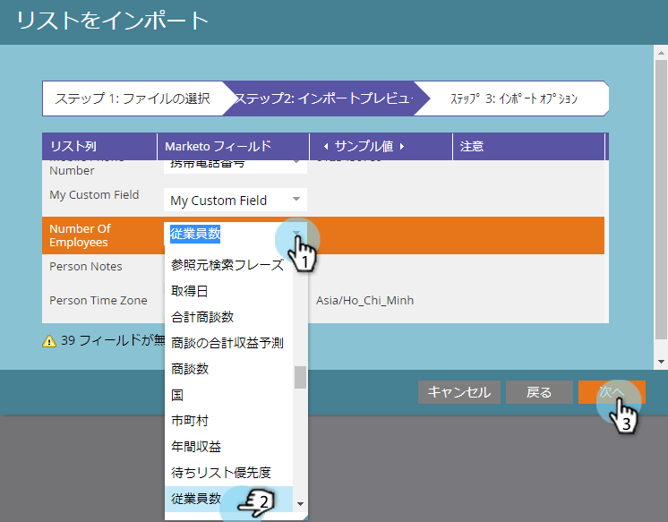
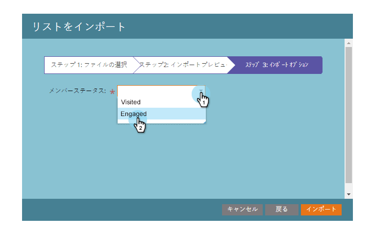
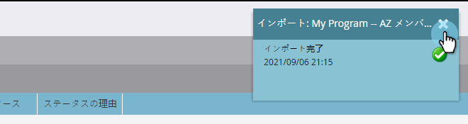
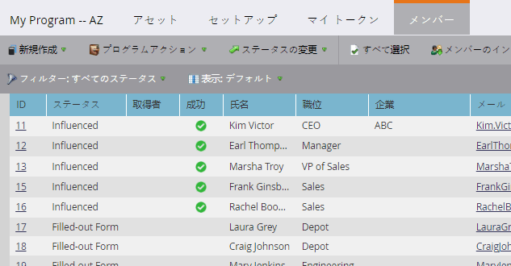

# スプレッドシートからプログラム{#import-members-from-a-spreadsheet-into-a-program}にメンバをインポート

プログラムのメンバーになるユーザーのリストをインポートできます。 どうすればいいか。

## CSVファイルの準備{#prepare-your-csv-file}

1. 以下の例のように、Excelで標準のCSVファイルを作成します。

   

   >[!CAUTION]
   >
   >日付を日付フィールドにインポートする場合は、次の形式を使用します。9/23/13（月/日/年）

## CSVをMarketorにインポート{#import-your-csv-into-marketo}

1. プログラムーで、**Members**&#x200B;セクションに移動します。

   

1. [**メンバのインポート**]をクリックします。

   

1. CSVを選択し、「**次へ**」をクリックします。

   

1. リストのデータ値を対応するマーケティング先フィールドにマップし、「**次へ**」をクリックします。

   

   >[!NOTE]
   >
   >インポートしたくないフィールドがある場合は、「マーケティング先フィールド」ドロップダウンメニューで「**IGNORE**」を選択します。

1. リストの&#x200B;**メンバーステータス**&#x200B;を選択します。

   

1. 「**インポート**」をクリックします。

   

1. マーケティングがインポートを終了するのを待ってから、確認ダイアログを閉じます。

   

   素晴らしい！ 読み込んだ新しいメンバーが表示されます。

   

>[!MORELIKETHIS]
>
>* [メンバーの管理と表示](manage-and-view-members.md)

>

