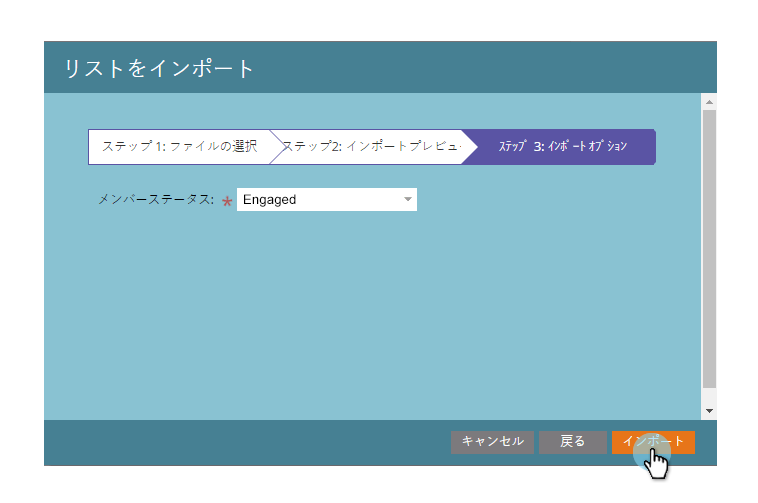

# スプレッドシートからプログラムへのメンバーのインポート {#import-members-from-a-spreadsheet-into-a-program}

人物のリストをインポートして、自動的にプログラムのメンバーにすることができます。その方法を説明します。

## CSV ファイルを準備する {#prepare-your-csv-file}

1. 以下の例のように、[!DNL Excel] で標準の CSV ファイルを作成します。

   

   >[!CAUTION]
   >
   >「日付」フィールドに日付をインポートする場合は、次の形式を使用します。9/29/24（月／日／年）

## CSV を Marketo にインポートする {#import-your-csv-into-marketo}

1. プログラムで、「**[!UICONTROL メンバー]**」セクションに移動します。

   

1. 「**[!UICONTROL メンバーをインポート]**」をクリックします。

   

1. CSV を選択し、「**[!UICONTROL 次へ]**」をクリックします。

   

1. リストのデータ値を対応する Marketo フィールドにマッピングし、「**[!UICONTROL 次へ]**」をクリックします。

   

   >[!NOTE]
   >
   >インポートしないフィールドがある場合は、Marketo フィールドドロップダウンメニューで「**[!UICONTROL 無視]**」を選択します。

1. リスト用の「**[!UICONTROL メンバーステータス]**」を選択します。

   

1. 「**[!UICONTROL インポート]**」をクリックします。

   

1. Marketo がインポートを完了するのを待ってから、確認ダイアログを閉じます。

   

   これで完了です。インポートした新しいメンバーが表示されます。

   

>[!MORELIKETHIS]
>
>[メンバーの管理および表示](/help/marketo/product-docs/core-marketo-concepts/programs/working-with-programs/manage-and-view-members.md){target="_blank"}
