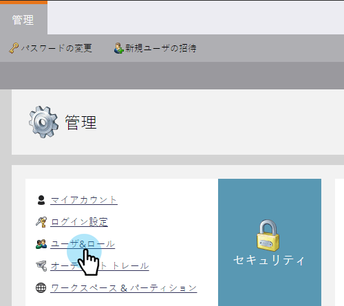
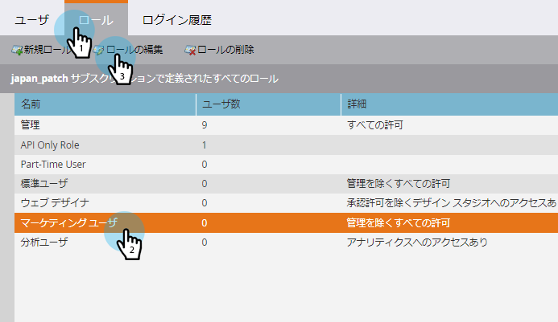
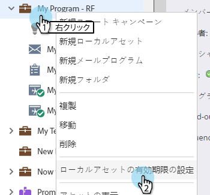
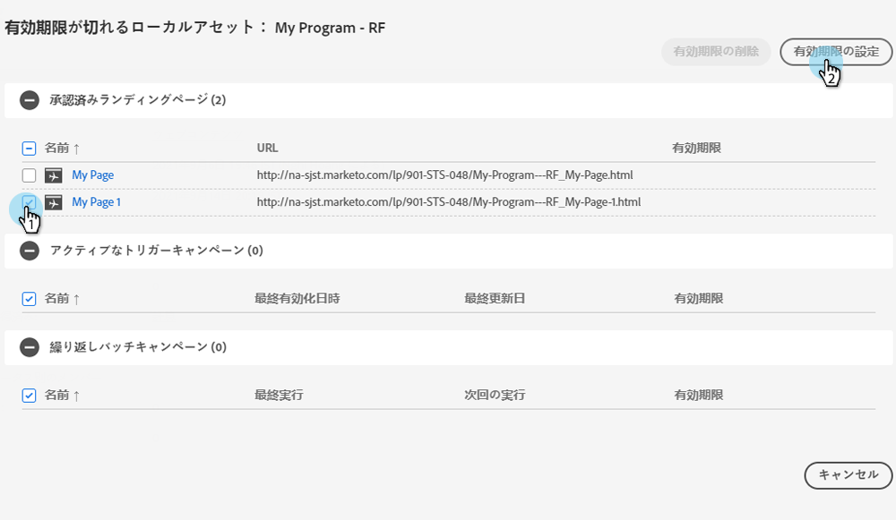
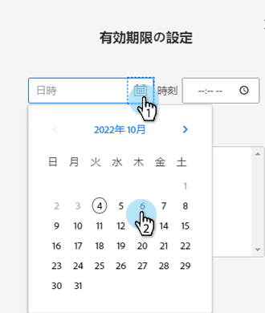
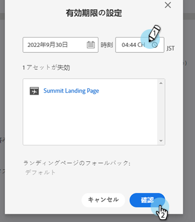
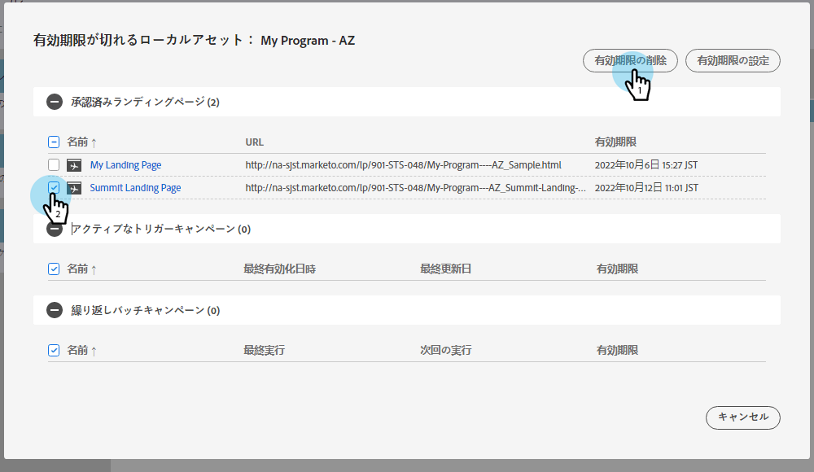
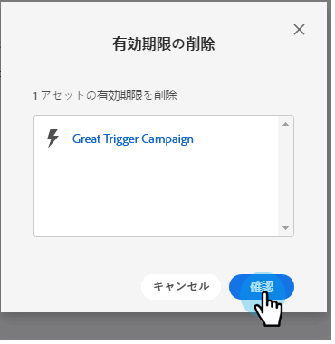

# ローカルアセットの有効期限 {#local-asset-expiration}

ランディングページの非公開、トリガーキャンペーンの非アクティブ化、繰り返しバッチキャンペーンの停止をおこなう有効期限を設定します。

## スケジュールアセットの有効期限権限の付与 {#grant-schedule-asset-expiration-permission}

アセットの有効期限をスケジュールする前に、Marketoの役割で適切な権限を有効にしておく必要があります。

>[!NOTE]
>
>**管理者権限が必要**

1. 内 [!UICONTROL 管理者] 領域、クリック **[!UICONTROL ユーザーとロール]**.

   

1. 次をクリック： **[!UICONTROL 役割]** 」タブで、アクセスを許可するユーザーを選択し、 **[!UICONTROL ロールの編集]**.

   

1. の下 [!UICONTROL マーケティング活動にアクセス]を選択します。 **[!UICONTROL アセットの有効期限のスケジュール]**. 「**[!UICONTROL 保存]**」をクリックします。

PICC

## 有効期限の設定 {#set-an-expiration-date}

1. 目的のプログラムを右クリックし、「 」を選択します。 **[!UICONTROL ローカルアセットの有効期限を設定]**.

   

1. 有効期限を設定するアセットを確認し、 **[!UICONTROL 有効期限を設定]**.

   

1. 有効期限を選択します。

   

1. 時間を設定します。 20 分以上後にスケジュールを設定する必要があります（AM/PM を入力することを忘れないでください）。 クリック **[!UICONTROL 確認]** 完了したら、

   

>[!NOTE]
>
>* 既存の有効期限を編集するには、アセットを確認し、 **[!UICONTROL 有効期限を設定]**.
>* 有効期限が切れたアセットは、有効期限グリッドに表示されなくなります。 グリッドには、公開済みのランディングページ、アクティブなトリガーキャンペーン、および繰り返し発生するバッチキャンペーンのみが表示されます。

## 有効期限の削除 {#remove-an-expiration-date}

1. 有効期限を削除するには、アセットを確認し、 **[!UICONTROL 有効期限を削除]**.

   

1. 影響を受けるアセットを確認し、 **[!UICONTROL 確認]**.

   

>[!NOTE]
>
>今後 15 分未満の有効期限は削除できません。 有効期限を「削除」するには、アセットの有効期限が切れるのを待ってから、アセットを再承認または再アクティブ化する必要があります。
