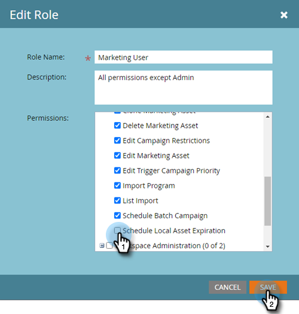

# ローカルアセットの有効期限 {#local-asset-expiration}

ランディングページの非公開、トリガーキャンペーンの非アクティブ化、繰り返しバッチキャンペーンの停止を実行する有効期限／時間を設定します。

## スケジュールアセットの有効期限権限の付与 {#grant-schedule-asset-expiration-permission}

アセットの有効期限をスケジュールする前に、Marketo のロールで適切な権限を有効にしておく必要があります。

>[!NOTE]
>
>**管理者権限が必要**

1. [!UICONTROL 管理者]領域で、「**[!UICONTROL ユーザ＆ロール]**」をクリックします。

   

1. 「**[!UICONTROL ロール]**」タブをクリックし、アクセスを許可するユーザを選択し、「**[!UICONTROL ロールを編集]**」をクリックします。

   

1. [!UICONTROL マーケティング活動にアクセス]で、「**[!UICONTROL ローカルアセットの有効期限をスケジュール]**」を選択し、「**[!UICONTROL 保存]**」をクリックします。

   

## 有効期限の設定 {#set-an-expiration-date}

1. 目的のプログラムを右クリックし、「**[!UICONTROL ローカルアセットの有効期限を設定]**」を選択します。

   

1. 有効期限を設定するアセットを確認し、「**[!UICONTROL 有効期限を設定]**」をクリックします。

   

1. 有効期限を選択します。

   

1. 時間を設定します。15 分以上後にスケジュールを設定する必要があります（午前または午後を入力することを忘れないでください）。終了したら「**[!UICONTROL 確認]**」をクリックします。

   

>[!NOTE]
>
>* 既存の有効期限を編集するには、アセットを確認し、「**[!UICONTROL 有効期限を設定]**」をクリックします。
>* 有効期限が切れたアセットは、有効期限グリッドに表示されなくなります。グリッドには、公開済みのランディングページ、アクティブなトリガーキャンペーンおよび繰り返しバッチキャンペーンのみが表示されます。
>* アセットが別のプログラムに移動されると、スケジュールされた有効期限は削除されます。

## 有効期限の削除 {#remove-an-expiration-date}

1. 有効期限を削除するには、アセットをチェックして、「**[!UICONTROL 有効期限を削除]**」をクリックします。

   

1. 影響を受けるアセットを確認し、「**[!UICONTROL 確認]**」をクリックします。

   

>[!NOTE]
>
>現在から 15 分未満の有効期限は削除できません。有効期限を「削除」するには、アセットの有効期限が切れるのを待ってから、アセットを再承認または再アクティブ化する必要があります。
