# メンバーの管理と表示 {#manage-and-view-members}

「メンバー」タブを使用して、プログラムでメンバーを管理および表示できます。

>[!NOTE]
>
>**ディープダイブ**
>
> [プログラムメンバーシップを詳しく調べます](../../../../product-docs/core-marketo-concepts/programs/creating-programs/understanding-program-membership.md)。

## メンバーの検索 {#search-for-a-member}

「Members」セクションの下部にある検索フィールドを使用して、名前、電子メール、肩書または会社でプログラムメンバーを検索します。

1. プログラムの「 **メンバ** 」タブをクリックします。

   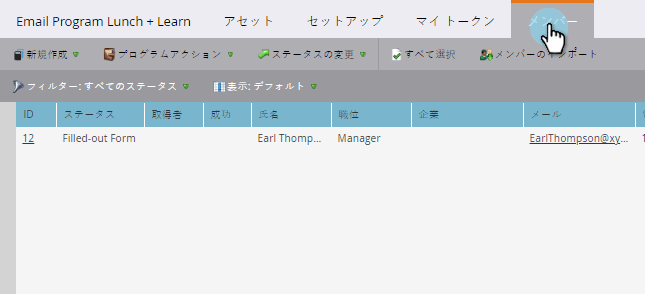

1. 検索フィールドを使用して、メンバーのリストを検索します。

   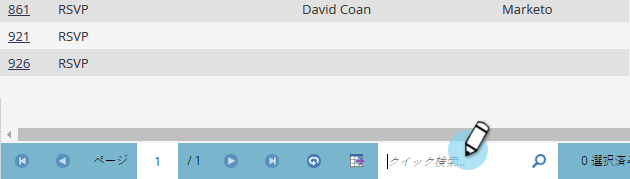

## メンバー・グリッドのエクスポート {#export-the-members-grid}

検索フィールドの横にあるExcelアイコンをクリックして、メンバーリストをエクスポートできます。

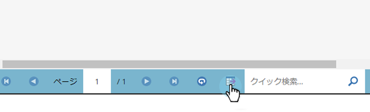

## メンバー・グリッドの列の管理 {#manage-columns-in-the-members-grid}

* 列の順序を変更するには、列をドラッグ&amp;ドロップします。 青い矢印のペアは、列の移動先を示します。

   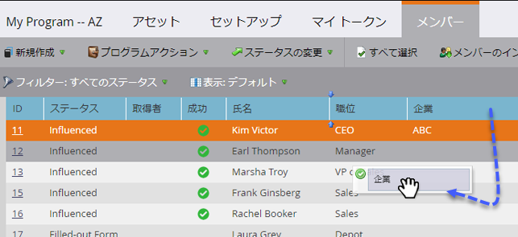

* 列見出しを右クリックして、アルファベット順（昇順または降順）に並べ替えます。

   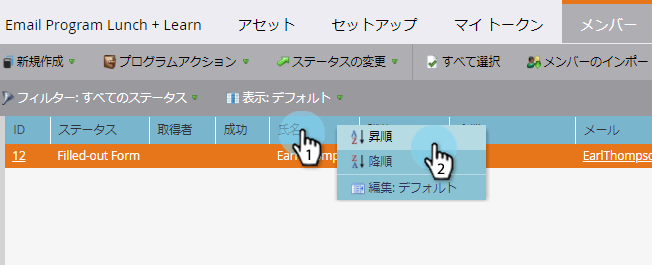

## グリッドに表示する列の選択 {#choose-which-columns-are-visible-in-the-grid}

1. 「**表示**」ドロップダウンをクリックし、「表示を **作成**」を選択します。

   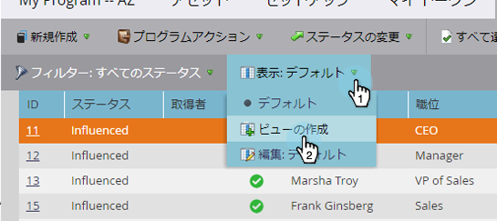

1. カスタム表示に名前を付けます。 列タイトルを選択します。 「**」 **と「** **」をクリックして、列を移動し、表示を作成します。

   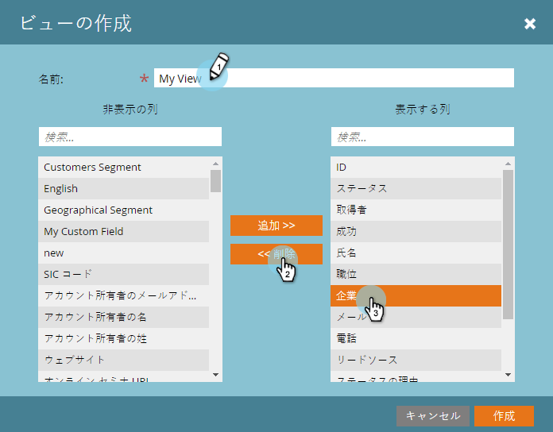

1. 「 **作成**」をクリックします。

   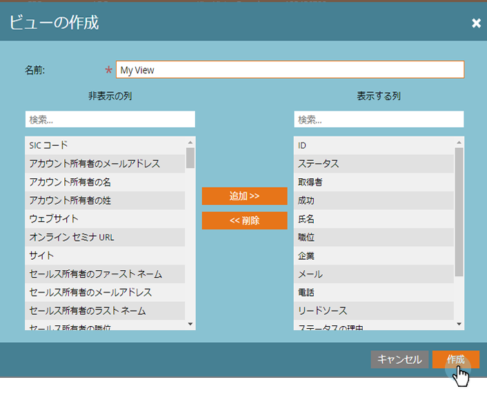

## メンバー・グリッドのフィルタ  {#filter-the-members-grid}

1. 「 **フィルター** 」ドロップダウンをクリックし、並べ替えの基準となる進行手順を選択します。

   

## メンバー・グリッドの個人ステータスの管理 {#manage-person-status-in-the-members-grid}

メンバーグリッド内でユーザーのステータスを変更できます。

1. Ctrl **またはCommandキーを押しながら** 、ユーザーを選択します。

   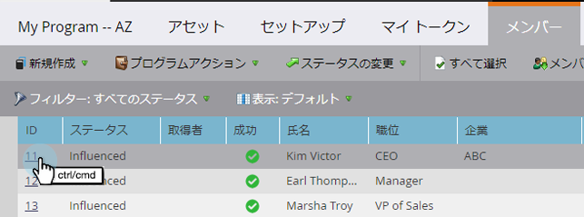

1. 「ステータス **の変更** 」ドロップダウンをクリックし、ステータスを選択します。

   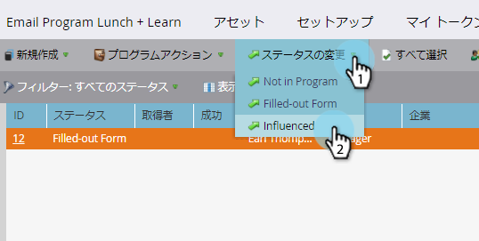

   これには少し時間がかかるかもしれません。 完了すると、以下のメッセージが表示されます。

   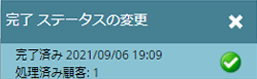

多くの特徴はありますが全てとても単刀直入です 楽しんで！

>[!MORELIKETHIS]
>
>* [プログラムパフォーマンスレポートの作成](../../../../product-docs/core-marketo-concepts/programs/program-performance-report/create-a-program-performance-report.md)

>

