# メンバーの管理および表示 {#manage-and-view-members}

プログラムのメンバーは、「メンバー」タブで管理・表示できます。

>[!NOTE]
>
>[プログラムメンバーシップ](/help/marketo/product-docs/core-marketo-concepts/programs/creating-programs/understanding-program-membership.md){target="_blank"}についてさらに深く学びましょう。

## メンバーの検索 {#search-for-a-member}

「メンバー」タブの下部にある「検索」フィールドでは、プログラムのメンバーを名前、メール、職位、企業から検索できます。

1. プログラムの「**[!UICONTROL メンバー]**」タブをクリックして移動します。

   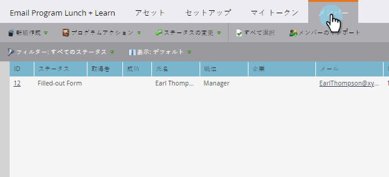

1. 検索フィールドからメンバーのリストを検索します。

   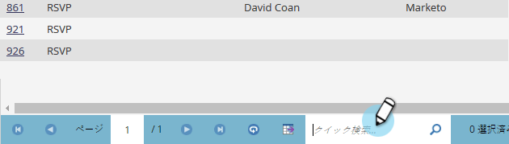

## メンバーグリッドのエクスポート {#export-the-members-grid}

検索フィールドの横の「[!DNL Excel]」アイコンをクリックすると、プログラムのメンバーリストを書き出すことができます。

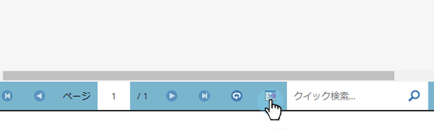

## メンバーグリッドの列の管理 {#manage-columns-in-the-members-grid}

列をドラッグ＆ドロップすると、列の並び順を変更できます。 青の矢印は列の移動先を示します。

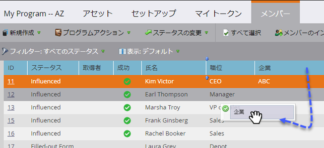

列ヘッダーを右クリックすると、アルファベット順（昇順または降順）でソートできます。

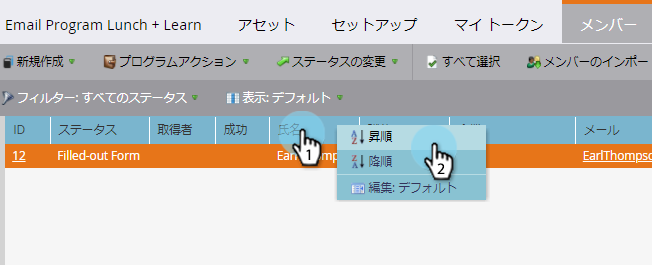

## グリッドに表示する列の選択 {#choose-which-columns-are-visible-in-the-grid}

1. 「**[!UICONTROL 表示]**」ドロップダウンをクリックして、「**[!UICONTROL 表示の作成]**」を選択します。

   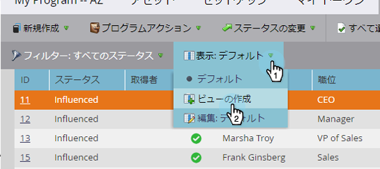

1. カスタム表示に名前を付けます。 列タイトルを選択します。 列タイトルを選択し、「**[!UICONTROL 追加]**」または「**[!UICONTROL 削除]**」をクリックして表示を作成します。

   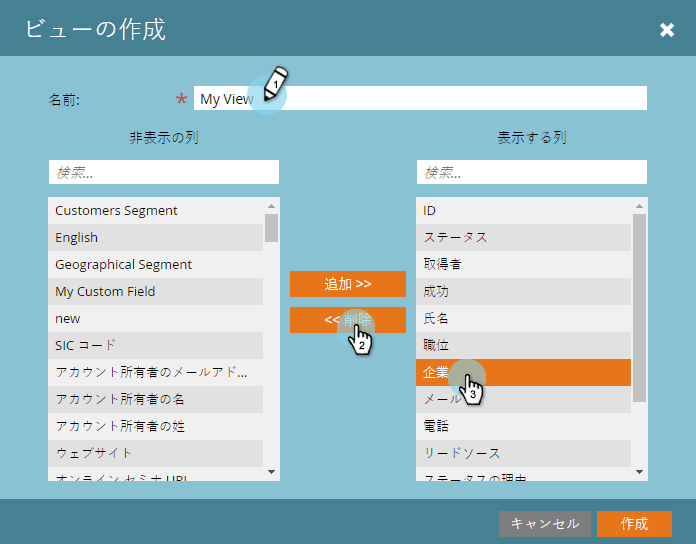

1. 「**[!UICONTROL 作成]**」をクリックします。

   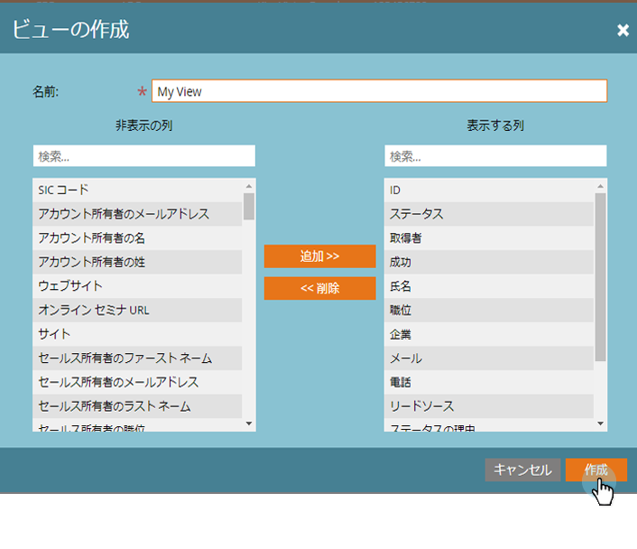

## メンバーグリッドへのフィルターの適用  {#filter-the-members-grid}

1. 「**[!UICONTROL フィルター]**」ドロップダウンを選択して、並び替えする進行状況ステップを選択します。

   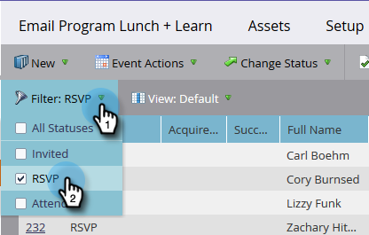

## メンバーグリッドのリードステータスの管理 {#manage-person-status-in-the-members-grid}

メンバーグリッド内のリードのステータスを変更できます。

1. **[!UICONTROL Ctrl/Cmd]** キーを押しながらリードを選択します。

   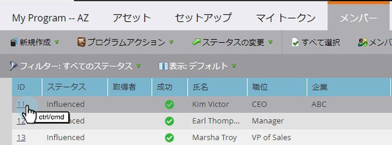

1. 「**[!UICONTROL ステータスの変更]**」ドロップダウンをクリックして、ステータスを選択します。

   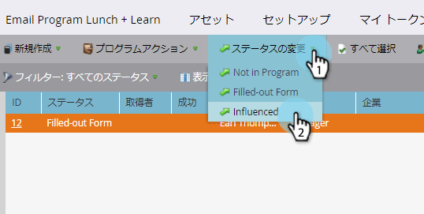

   少し時間がかかる場合があります。 プロセスが完了すると、以下のメッセージが表示されます。

   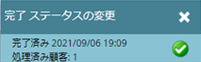

>[!MORELIKETHIS]
>
>[プログラム効果レポートの作成](/help/marketo/product-docs/core-marketo-concepts/programs/program-performance-report/create-a-program-performance-report.md){target="_blank"}
