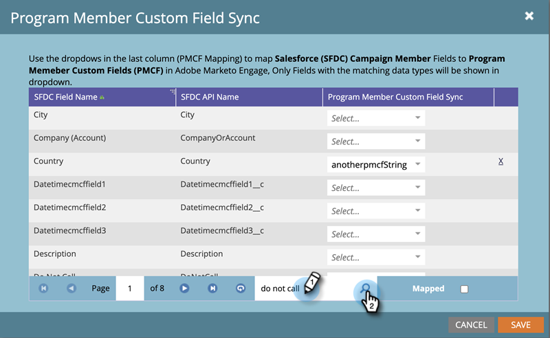

# プログラムメンバーカスタムフィールドの同期 {#program-member-custom-field-sync}

>[!PREREQUISITES]
>
>* [プログラムメンバーカスタムフィールド](/help/marketo/product-docs/core-marketo-concepts/programs/working-with-programs/program-member-custom-fields.md){target="_blank"}の作成
>* [ キャンペーン  [!DNL Salesforce]  プログラムとの同期 ](/help/marketo/product-docs/core-marketo-concepts/programs/working-with-programs/sync-an-sfdc-campaign-with-a-program.md){target="_blank"}

>[!NOTE]
>
>プログラムメンバーオブジェクトには、最大 20 個のカスタムフィールドを持つことができます。これらのフィールドは、どのプログラムでも使用できます。

## Salesforce フィールドをプログラムメンバーカスタムフィールドにマッピング {#map-salesforce-fields-to-program-member-custom-fields}

1. Marketo で、「**[!UICONTROL 管理者]**」をクリックします。

   

1. 「**[!DNL Salesforce]**」をクリックし、「プログラムメンバーのカスタムフィールド同期」の横にある「**[!UICONTROL 編集]**」をクリックします。

   

1. 検索ボックスを使用して、マッピングする [!DNL Salesforce] フィールドを見つけます。 この例では、Do Not Call を使用しています。

   

1. ドロップダウンをクリックします。

   

1. マッピングするMarketo[!UICONTROL  プログラムメンバーカスタムフィールド ] を選択します。

   

   >[!NOTE]
   >
   >ドロップダウンには、[!UICONTROL  のフィールドのデータタイプに一致する ] プログラムメンバーカスタムフィールド [!DNL Salesforce] のみが表示されます。

1. さらにフィールドマッピングを行う場合は、検索ボックスをクリアし、手順 3～5 を繰り返します。

1. 終了したら「**[!UICONTROL 保存]**」をクリックします。

   

   >[!IMPORTANT]
   >
   >マッピングされたフィールド上のプログラムメンバーデータに対する変更は、今後、Marketoと [!DNL Salesforce] の間で同期されます。

   >[!NOTE]
   >
   >[!DNL Salesforce] のフィールドのデータタイプの名前を変更または変更する場合、[!UICONTROL  プログラムメンバーカスタムフィールド ] を使用して、そのフィールドのマッピングを削除します。 ただし、レビュー後に新しいフィールドで再マッピングできます。

## プログラムメンバーカスタムフィールドから Salesforce フィールドのマッピングを解除 {#unmap-salesforce-fields-from-program-member-custom-fields}

フィールドを置き換えるために解放する場合や、一般的な変更を行う場合は、最初にマッピング解除を実行する必要があります。手順は以下のとおりです。

1. Marketo で、「**[!UICONTROL 管理者]**」をクリックします。

   

1. 「**[!DNL Salesforce]**」をクリックし、「プログラムメンバーのカスタムフィールド同期」の横にある「**[!UICONTROL 編集]**」をクリックします。

   

1. 検索ボックスを使用して、マッピングを解除するフィールドを見つけます。この例では、Do Not Call を使用しています。

   

   >[!TIP]
   >
   >「**[!UICONTROL マッピング済み]**」チェックボックスをオンにすると、マッピングしたフィールドのみが表示されます。

1. フィールドの横にある「**X**」をクリックしてマッピングを解除します。

   

1. これで、マッピングが削除されます。「**[!UICONTROL 保存]**」をクリックします。

   

## データタイプマッピング {#data-type-mapping}

<table>
  <colgroup>
    <col/>
    <col/>
  </colgroup>
  <tbody>
    <tr>
      <th>SFDC データタイプ</th>
      <th>プログラムメンバーカスタムフィールドデータタイプ</th>
    </tr>
    <tr>
      <td>テキスト</td>
      <td>文字列</td>
    </tr>
    <tr>
      <td>選択リスト</td>
      <td>文字列</td>
    </tr>
    <tr>
      <td>複数選択リスト</td>
      <td>文字列</td>
    </tr>
    <tr>
      <td>電話</td>
      <td>文字列</td>
    </tr>
    <tr>
      <td>メール</td>
      <td>文字列</td>
    </tr>
    <tr>
      <td>数値（m）</td>
      <td>整数</td>
    </tr>
    <tr>
      <td>数値（m、n）</td>
      <td>浮動</td>
    </tr>
    <tr>
      <td>チェックボックス</td>
      <td>ブール値</td>
    </tr>
    <tr>
      <td>URL</td>
      <td>URL</td>
    </tr>
    <tr>
      <td>日付</td>
      <td>日付</td>
    </tr>
    <tr>
      <td>日時</td>
      <td>日時</td>
    </tr>
    <tr>
      <td>参照（reference）</td>
      <td>文字列</td>
    </tr>
    <tr>
      <td>Base64</td>
      <td>文字列</td>
    </tr>
  </tbody>
</table>

>[!MORELIKETHIS]
>
>* [プログラムメンバーを変更](/help/marketo/product-docs/core-marketo-concepts/smart-campaigns/program-flow-actions/change-program-member-data.md){target="_blank"}
>* [プログラムメンバーグリッドのデータを表示](/help/marketo/product-docs/core-marketo-concepts/programs/working-with-programs/manage-and-view-members.md){target="_blank"}
>* [SFDC 同期 - キャンペーンの同期](/help/marketo/product-docs/crm-sync/salesforce-sync/sfdc-sync-details/sfdc-sync-campaign-sync.md){target="_blank"}
